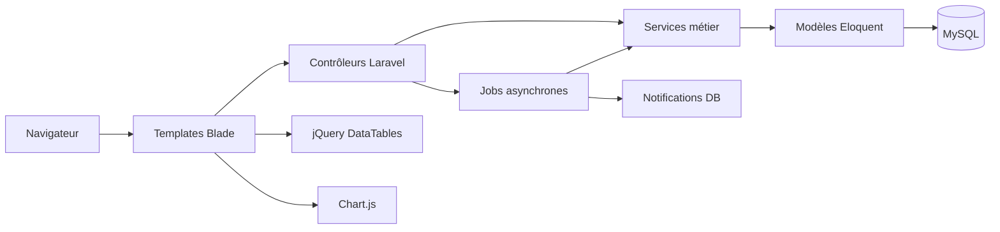

# 1. Résumé général de l'application

## But global

**Rapprochement STEG** est une application de **rapprochement bancaire automatisé** (bank reconciliation) destinée au Département Informatique de la STEG (Société Tunisienne de l'Électricité et du Gaz).

L'application permet :
- D'**importer** des fichiers de paiement provenant de quatre sources bancaires différentes
- De **normaliser** les données importées dans un format unifié
- De **faire correspondre automatiquement** les transactions entre sources selon des règles configurables
- De **gérer manuellement** les exceptions et les cas non résolus automatiquement
- De **suivre** l'ensemble via un tableau de bord, des exports et un journal d'audit

## Problème métier résolu

Les paiements de la STEG transitent par plusieurs canaux bancaires (ALPHA, BNA, WEB/STEG, SMT). Chaque banque produit des fichiers avec des formats, des colonnes et des conventions de nommage différents. Le rapprochement manuel est fastidieux, source d'erreurs et difficile à auditer.

L'application automatise :
1. La lecture et la normalisation de formats hétérogènes
2. L'appariement inter-banques selon des règles métier validées
3. La détection des doublons et des anomalies
4. La traçabilité complète de chaque opération

## Principales fonctionnalités

| Fonctionnalité | Description |
|----------------|-------------|
| **Import de fichiers** | Upload CSV/XLSX, validation des en-têtes, transformation et normalisation des données |
| **Rapprochement automatique** | 6 règles d'appariement inter-sources (ALPHA-BNA, SMT-BNA, WEB-BNA, ALPHA-WEB, ALPHA-SMT, WEB-SMT) |
| **Rapprochement manuel** | Interface deux panneaux pour apparier manuellement les transactions non résolues |
| **Gestion des exceptions** | Typage (montant, date, doublon, orphelin), résolution, commentaires, pièces jointes |
| **Tableau de bord** | KPIs, graphiques (Chart.js), tendances sur 30 jours |
| **Recherche multicritère** | Filtrage par source, référence, montant, date, statut, canal |
| **Exports** | CSV, XLSX (Maatwebsite), PDF (dompdf) pour les résultats et exceptions |
| **Administration** | CRUD banques, sources, devises, jours fériés, paramètres, utilisateurs, rôles |
| **Journal d'audit** | Traçabilité complète des créations/modifications/suppressions |
| **Notifications** | Notifications en base de données pour les traitements asynchrones |

## Types d'utilisateurs

L'application distingue plusieurs rôles (gérés via `spatie/laravel-permission`) :

| Rôle | Description |
|------|-------------|
| **super-admin** | Accès total, bypass des permissions |
| **admin** | Accès à toutes les fonctionnalités d'administration |
| **director** | Lecture seule + accès au journal d'audit |
| **department-head** | CRUD complet sur les ressources métier et les utilisateurs |
| **execution-agent** | Rapprochement manuel et gestion des exceptions |
| **auditor** | Lecture seule + accès au journal d'audit |
| **operator** | Opérations quotidiennes de rapprochement |

> **Note :** Les rôles exacts sont définis dans le seeder `database/seeders/RolePermissionSeeder.php`.

## Grands domaines fonctionaux

```
┌─────────────────────────────────────────────────────────────────┐
│                        RAPPROCHEMENT STEG                        │
├─────────────────────────────────────────────────────────────────┤
│                                                                  │
│  ┌──────────┐  ┌──────────────┐  ┌──────────────┐  ┌─────────┐ │
│  │  IMPORT  │→│ NORMALISATION│→│  RAPPROCHEMENT│→│ EXPORT  │ │
│  │          │  │              │  │              │  │         │ │
│  │ CSV/XLSX │  │ Transform    │  │ Automatique  │  │ CSV/XLSX│ │
│  │ Upload   │  │ Normalize    │  │ Manuel       │  │ PDF     │ │
│  └──────────┘  └──────────────┘  └──────────────┘  └─────────┘ │
│                                                                  │
│  ┌──────────┐  ┌──────────────┐  ┌──────────────┐              │
│  │ DASHBOARD│  │   RECHERCHE  │  │   AUDIT      │              │
│  │          │  │              │  │              │              │
│  │ KPIs     │  │ Multicritère │  │ Journal      │              │
│  │ Graphiques│ │ Filtres      │  │ Historique   │              │
│  └──────────┘  └──────────────┘  └──────────────┘              │
│                                                                  │
│  ┌──────────────────────────────────────────────────────────┐   │
│  │                    ADMINISTRATION                         │   │
│  │  Banques │ Sources │ Devises │ Utilisateurs │ Rôles      │   │
│  └──────────────────────────────────────────────────────────┘   │
│                                                                  │
└─────────────────────────────────────────────────────────────────┘
```

## Architecture synthétique



**En résumé :**
- **Frontend :** Templates Blade rendus côté serveur + jQuery/DataTables/Chart.js pour l'interactivité
- **Backend :** Laravel 12 (MVC classique avec couche Service)
- **Base de données :** MySQL 8 (avec SQLite pour les tests)
- **Files d'attente :** Database driver (jobs stockés en base)
- **Pas de microservices, pas d'API externe, pas de SPA**
