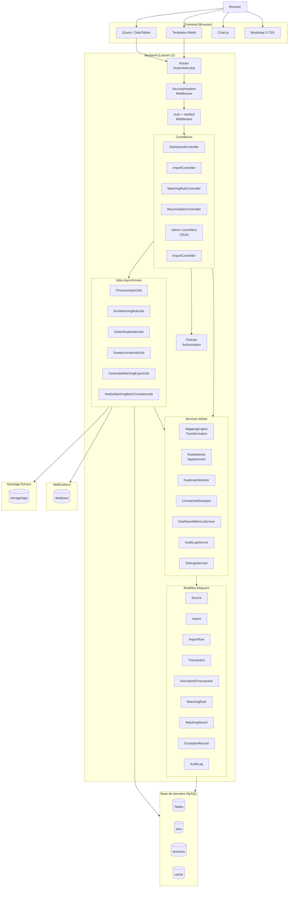

# 4. Architecture globale

## Type d'architecture

L'application suit une architecture **monolithique MVC classique avec couche Service** :

```
┌─────────────────────────────────────────────────────────────────────────────┐
│                              NAVIGATEUR (Browser)                           │
│                         HTML / CSS / JS (jQuery + Bootstrap)               │
└─────────────────────────────────────────────────────────────────────────────┘
                                       │
                                       ▼
┌─────────────────────────────────────────────────────────────────────────────┐
│                         COUCHE PRÉSENTATION (Blade)                         │
│   Templates Blade + Composants Blade + Inline JS (DataTables, Chart.js)    │
└─────────────────────────────────────────────────────────────────────────────┘
                                       │
                                       ▼
┌─────────────────────────────────────────────────────────────────────────────┐
│                         COUCHE ROUTAGE (Laravel Router)                     │
│              routes/web.php → Middleware → Controllers                      │
└─────────────────────────────────────────────────────────────────────────────┘
                                       │
                                       ▼
┌─────────────────────────────────────────────────────────────────────────────┐
│                         COUCLE CONTRÔLE (Controllers)                       │
│              Injection dépendances → Appel Services                         │
└─────────────────────────────────────────────────────────────────────────────┘
                                       │
                                       ▼
┌─────────────────────────────────────────────────────────────────────────────┐
│                         COUCHE MÉTIER (Services)                            │
│     MappingEngine / RuleMatcher / DuplicateDetector / DashboardMetrics     │
└─────────────────────────────────────────────────────────────────────────────┘
                                       │
                                       ▼
┌─────────────────────────────────────────────────────────────────────────────┐
│                         COUCHE DONNÉES (Eloquent ORM)                       │
│                    Modèles + Migrations + Seeders + Policies               │
└─────────────────────────────────────────────────────────────────────────────┘
                                       │
                                       ▼
┌─────────────────────────────────────────────────────────────────────────────┐
│                              BASE DE DONNÉES (MySQL)                        │
└─────────────────────────────────────────────────────────────────────────────┘
```

## Diagramme d'architecture global



## Flux de données typique

### Cycle d'une requête HTTP

```
HTTP Request (navigateur)
    ↓
Route (routes/web.php)
    ↓
Middleware SecurityHeaders (global)
    ↓
Middleware auth + verified (si protégé)
    ↓
Policy authorize() (si définie)
    ↓
Controller méthode()
    ↓
Service métier()
    ↓
Model Eloquent → Query Builder → SQL
    ↓
Base de données MySQL
    ↓
Collection/Model (PHP)
    ↓
View Blade compilée → HTML
    ↓
HTTP Response (+ headers sécurité)
```

### Flux d'un traitement asynchrone (Job)

```
Controller → dispatch(new ProcessImportJob($importId))
    ↓
File d'attente (table jobs)
    ↓
Worker (php artisan queue:work)
    ↓
Job::handle()
    ↓
Service métier (MappingEngine, RuleMatcher, etc.)
    ↓
Modèles → Base de données
    ↓
Notification (table notifications)
    ↓
 Marquage terminé
```

## Séparation des responsabilités

| Couche | Responsabilité | Fichiers |
|--------|----------------|----------|
| **Route** | Association URL → contrôleur | `routes/web.php`, `routes/auth.php` |
| **Middleware** | Filtres globaux (sécurité) | `app/Http/Middleware/SecurityHeaders.php` |
| **Controller** | Orchestration, extraction params, appel services, retour vue/json | `app/Http/Controllers/` |
| **Form Request** | Validation des données entrantes | `app/Http/Requests/` |
| **Policy** | Autorisation par modèle | `app/Policies/` |
| **Service** | Logique métier réutilisable | `app/Services/` |
| **Job** | Traitement différé asynchrone | `app/Jobs/` |
| **Notification** | Notification utilisateur en base | `app/Notifications/` |
| **Model** | Accès données, relations, casts | `app/Models/` |
| **DTO** | Transfert de données typé | `app/DataTransferObjects/` |
| **Enum** | Constantes typées | `app/Enums/` |
| **Blade Template** | Rendu HTML | `resources/views/` |

## Patterns utilisés

| Pattern | Implémentation | Fichiers |
|---------|----------------|----------|
| **MVC** | Structure Laravel classique | `app/Http/Controllers/`, `app/Models/`, `resources/views/` |
| **Service Layer** | Logique métier extraite des contrôleurs | `app/Services/` |
| **Repository** | Accès données paramétrage | `app/Repositories/SettingsRepositoryInterface.php`, `EloquentSettingsRepository.php` |
| **Observer** | Audit automatique des modèles | `app/Observers/AuditObserver.php`, `app/Models/Concerns/Auditable.php` |
| **Job/Queue** | Traitement asynchrone | `app/Jobs/` |
| **Strategy** | Transformations interchangeables | `app/Contracts/TransformPrimitive.php`, `app/Services/Import/Transforms/` |
| **Factory** | Création de lecteurs de fichiers | `app/Services/Import/Readers/ImportRowReaderFactory.php` |
| **DTO** | Transfert de données typé | `app/DataTransferObjects/` |

## Découpage par modules fonctionnels

```
┌─────────────────────────────────────────────────────────────────────────┐
│                          MODULES FONCTIONNELS                           │
├─────────────────────────────────────────────────────────────────────────┤
│                                                                         │
│  ┌─────────────────┐  ┌─────────────────┐  ┌─────────────────────────┐ │
│  │  AUTHENTICATION │  │    DASHBOARD    │  │     NOTIFICATIONS       │ │
│  │  Breeze + Spatie│  │  KPIs + Charts  │  │    Centre + Database    │ │
│  └─────────────────┘  └─────────────────┘  └─────────────────────────┘ │
│                                                                         │
│  ┌─────────────────────────────────────────────────────────────────┐   │
│  │                     MODULE IMPORT                                │   │
│  │  Upload → Validation → Transform → Normalize → Bulk Insert      │   │
│  │  Contrôleur: ImportController                                   │   │
│  │  Services: MappingEngine, TransactionNormalizer, Readers        │   │
│  │  Job: ProcessImportJob                                          │   │
│  └─────────────────────────────────────────────────────────────────┘   │
│                                                                         │
│  ┌─────────────────────────────────────────────────────────────────┐   │
│  │                     MODULE MATCHING                              │   │
│  │  Règles → Appariement → Résultats → Exceptions                  │   │
│  │  Contrôleurs: MatchingRuleController, MatchingResultController  │   │
│  │  Services: RuleMatcher, DuplicateDetector, UnmatchedSweeper     │   │
│  │  Jobs: RunMatchingRuleJob, DetectDuplicatesJob, etc.            │   │
│  └─────────────────────────────────────────────────────────────────┘   │
│                                                                         │
│  ┌─────────────────────────────────────────────────────────────────┐   │
│  │                  MODULE RECONCILIATION                           │   │
│  │  Recherche → Sélection → Appariement manuel                     │   │
│  │  Contrôleur: ReconciliationController                           │   │
│  └─────────────────────────────────────────────────────────────────┘   │
│                                                                         │
│  ┌─────────────────────────────────────────────────────────────────┐   │
│  │                  MODULE EXCEPTIONS                               │   │
│  │  Liste → Détail → Résolution → Pièces jointes                   │   │
│  │  Contrôleurs: ExceptionController, ExceptionAttachmentController│   │
│  └─────────────────────────────────────────────────────────────────┘   │
│                                                                         │
│  ┌─────────────────────────────────────────────────────────────────┐   │
│  │                  MODULE ADMIN (CRUD)                             │   │
│  │  Banques, Sources, Devises, Jours fériés, Paramètres, Users     │   │
│  │  Contrôleurs: BankController, SourceController, etc.            │   │
│  └─────────────────────────────────────────────────────────────────┘   │
│                                                                         │
│  ┌─────────────────────────────────────────────────────────────────┐   │
│  │                     MODULE AUDIT                                 │   │
│  │  Lecture seule → Historique → Détail valeurs                    │   │
│  │  Contrôleur: AuditLogController                                 │   │
│  │  Service: AuditLogService                                       │   │
│  └─────────────────────────────────────────────────────────────────┘   │
│                                                                         │
└─────────────────────────────────────────────────────────────────────────┘
```

## Dépendances entre couches

```
Controllers dépendent de → Services, Jobs, Requests, Policies
Services dépendent de → Models, DTOs, Contracts, Enums
Jobs dépendent de → Services, Notifications
Models dépendent de → Concerns (Traits), Enums
Policies dépendent de → Models, Enums
Notifications dépendent de → Models, DTOs
Listeners dépendent de → AuditLogService
```

## Technologies par module

| Module | Backend | Frontend | Services externes |
|--------|---------|----------|-------------------|
| Auth | Breeze + Spatie | Blade forms | - |
| Dashboard | DashboardMetricsService | Chart.js | - |
| Import | ProcessImportJob, MappingEngine | jQuery DataTables | Maatwebsite/Excel |
| Matching | RuleMatcher, Jobs | Blade forms | - |
| Reconciliation | ReconciliationController | jQuery AJAX | - |
| Exceptions | ExceptionController | jQuery DataTables | DomPDF |
| Admin CRUD | Controllers + Requests | jQuery DataTables | - |
| Audit | AuditLogService + Observer | jQuery DataTables | - |
| Settings | SettingsService + Repository | Blade forms | - |
