# 6. Pages et navigation

## Navigation principale

### Sidebar admin

**Fichier :** `resources/views/components/admin/sidebar.blade.php`

La sidebar est une navigation verticale fixe (260px) avec des sections permission-gated :

```
┌─────────────────────────────────────────┐
│  🏠 Tableau de bord                     │
├─────────────────────────────────────────┤
│  RECHERCHE                              │
│  🔍 Recherche multicritère              │
├─────────────────────────────────────────┤
│  IMPORTS                                │
│  📤 Imports de fichiers                 │
├─────────────────────────────────────────┤
│  RAPPROCHEMENT                          │
│  🔀 Règles de rapprochement             │
│  🔗 Résultats de rapprochement          │
│  👆 Rapprochement manuel                │
│  ⚠️  Exceptions                         │
├─────────────────────────────────────────┤
│  PARAMÉTRAGE                            │
│  🏦 Banques                             │
│  📊 Sources                             │
│  💰 Devises                             │
│  📅 Jours fériés                        │
│  ⚙️  Paramètres                         │
├─────────────────────────────────────────┤
│  ADMINISTRATION                         │
│  👥 Utilisateurs                        │
│  🔒 Rôles & Permissions                 │
├─────────────────────────────────────────┤
│  SUIVI                                  │
│  📋 Journal d'audit                     │
└─────────────────────────────────────────┘
```

### Topbar

**Fichier :** `resources/views/components/admin/topbar.blade.php`

- Logo + nom application
- Bouton toggle thème (dark/light)
- Dropdown notifications (8 dernières non lues)
- Dropdown utilisateur (profil + déconnexion)

## Diagramme de navigation

```mermaid
flowchart TD
    Login[Login] --> Dashboard[Dashboard]
    
    Dashboard --> Search[Recherche multicritère]
    Dashboard --> Profile[Profil]
    Dashboard --> Notifications[Notifications]
    
    subgraph Imports["Imports"]
        ImportList[Liste imports]
        ImportCreate[Upload fichier]
        ImportShow[Détail import]
    end
    
    subgraph Matching["Rapprochement"]
        RuleList[Règles]
        RuleCreate[Nouvelle règle]
        RuleEdit[Modifier règle]
        ResultList[Résultats]
        ResultShow[Détail résultat]
        Reconciliation[Rapprochement manuel]
        ExceptionList[Exceptions]
        ExceptionShow[Détail exception]
    end
    
    subgraph Admin["Paramétrage"]
        BankList[Banques]
        SourceList[Sources]
        SourceMapping[Mapping colonnes]
        CurrencyList[Devises]
        HolidayList[Jours fériés]
        Settings[Paramètres]
    end
    
    subgraph Users["Administration"]
        UserList[Utilisateurs]
        RoleList[Rôles]
    end
    
    subgraph Audit["Suivi"]
        AuditList[Journal d'audit]
        AuditShow[Détail entrée]
    end
    
    Dashboard --> ImportList
    ImportList --> ImportCreate
    ImportList --> ImportShow
    
    Dashboard --> RuleList
    RuleList --> RuleCreate
    RuleList --> RuleEdit
    RuleList --> ResultList
    ResultList --> ResultShow
    Dashboard --> Reconciliation
    Dashboard --> ExceptionList
    ExceptionList --> ExceptionShow
    
    Dashboard --> BankList
    Dashboard --> SourceList
    SourceList --> SourceMapping
    Dashboard --> CurrencyList
    Dashboard --> HolidayList
    Dashboard --> Settings
    
    Dashboard --> UserList
    Dashboard --> RoleList
    
    Dashboard --> AuditList
    AuditList --> AuditShow
```



## Fiches pages principales

### Dashboard

| Attribut | Valeur |
|----------|--------|
| **Route** | `GET /dashboard` |
| **Nom** | `dashboard` |
| **Contrôleur** | `DashboardController@index` |
| **Vue** | `resources/views/dashboard.blade.php` |
| **Layout** | `<x-app-layout>` |
| **Permissions** | Authentifié + email vérifié |
| **Objectif** | Vue d'ensemble KPIs + graphiques |
| **Données** | `DashboardMetricsService` (KPIs, stats, tendances) |
| **Composants** | 4 cards KPI, 4 graphiques Chart.js |
| **Actions** | Aucune (lecture seule) |

**KPIs affichés :**
- Total transactions
- Exceptions ouvertes
- Imports ce mois
- Taux de matching

**Graphiques :**
- Résultats de matching (doughnut)
- Exceptions par type (doughnut)
- Volume par source (bar)
- Tendance 30 jours (line)

---

### Imports — Liste

| Attribut | Valeur |
|----------|--------|
| **Route** | `GET /admin/imports` |
| **Nom** | `admin.imports.index` |
| **Contrôleur** | `ImportController@index` |
| **Vue** | `resources/views/admin/imports/index.blade.php` |
| **DataTables** | `GET /admin/imports/data` → `ImportController@data` |
| **Permissions** | `imports.viewAny` |
| **Objectif** | Lister tous les imports avec statut |
| **Colonnes** | Source, fichier, statut, lignes, erreurs, durée, utilisateur, date, actions |
| **Actions** | Voir, Supprimer, Traiter |

---

### Imports — Upload

| Attribut | Valeur |
|----------|--------|
| **Route** | `GET /admin/imports/create` |
| **Nom** | `admin.imports.create` |
| **Contrôleur** | `ImportController@create` |
| **Vue** | `resources/views/admin/imports/create.blade.php` |
| **Store** | `POST /admin/imports` → `ImportController@store` |
| **Permissions** | `imports.create` |
| **Objectif** | Uploader un fichier CSV/XLSX |
| **Champs** | Source (select), Fichier (input file), Confirmation doublon |
| **Validation** | `StoreImportRequest` |
| **Services** | `ImportRowReaderFactory`, `MappingEngine::validateHeaders()` |
| **Actions** | Soumettre → crée l'import, valide headers, dispatch job si OK |

---

### Imports — Détail

| Attribut | Valeur |
|----------|--------|
| **Route** | `GET /admin/imports/{import}` |
| **Nom** | `admin.imports.show` |
| **Contrôleur** | `ImportController@show` |
| **Vue** | `resources/views/admin/imports/show.blade.php` |
| **Permissions** | `imports.view` |
| **Objectif** | Voir le détail d'un import |
| **Données** | Métadonnées, statut, tableau des lignes avec raw/transformed/normalized |
| **Actions** | Traiter (si pending), Supprimer |

---

### Matching Rules — Liste

| Attribut | Valeur |
|----------|--------|
| **Route** | `GET /admin/matching-rules` |
| **Nom** | `admin.matching-rules.index` |
| **Contrôleur** | `MatchingRuleController@index` |
| **Vue** | `resources/views/admin/matching-rules/index.blade.php` |
| **DataTables** | `GET /admin/matching-rules/data` → `MatchingRuleController@data` |
| **Permissions** | `matching-rules.viewAny` |
| **Objectif** | Lister les règles de rapprochement |
| **Actions** | Créer, Modifier, Supprimer, Exécuter, Lancer tout, Détecter doublons, Balayer orphelins |

---

### Matching Rules — Création

| Attribut | Valeur |
|----------|--------|
| **Route** | `GET /admin/matching-rules/create` |
| **Nom** | `admin.matching-rules.create` |
| **Contrôleur** | `MatchingRuleController@create` |
| **Vue** | `resources/views/admin/matching-rules/create.blade.php` |
| **Store** | `POST /admin/matching-rules` → `MatchingRuleController@store` |
| **Permissions** | `matching-rules.create` |
| **Objectif** | Créer une règle de rapprochement |
| **Champs** | Nom, Description, Source A, Source B, Cardinalité, Priorité, Tolérances, Statuts exclus |
| **Validation** | `StoreMatchingRuleRequest` |

---

### Matching Results — Liste

| Attribut | Valeur |
|----------|--------|
| **Route** | `GET /admin/matching-results` |
| **Nom** | `admin.matching-results.index` |
| **Contrôleur** | `MatchingResultController@index` |
| **Vue** | `resources/views/admin/matching-results/index.blade.php` |
| **DataTables** | `GET /admin/matching-results/data` → `MatchingResultController@data` |
| **Permissions** | `matching-results.viewAny` |
| **Objectif** | Lister les résultats de matching |
| **Filtres** | Règle, batch, date début, date fin, statut |
| **Actions** | Voir, Supprimer, Exporter (CSV/XLSX/PDF) |

---

### Reconciliation — Rapprochement manuel

| Attribut | Valeur |
|----------|--------|
| **Route** | `GET /admin/reconciliation` |
| **Nom** | `admin.reconciliation.index` |
| **Contrôleur** | `ReconciliationController@index` |
| **Vue** | `resources/views/admin/reconciliation/index.blade.php` |
| **Search** | `GET /admin/reconciliation/search` → `ReconciliationController@search` |
| **Store** | `POST /admin/reconciliation` → `ReconciliationController@store` |
| **Permissions** | `matching-results.create` |
| **Objectif** | Apparier manuellement les transactions non résolues |
| **Interface** | Deux panneaux (Side A / Side B) avec recherche, pagination, sélection |
| **Actions** | Rechercher, Sélectionner, Soumettre l'appariement |

---

### Exceptions — Liste

| Attribut | Valeur |
|----------|--------|
| **Route** | `GET /admin/exceptions` |
| **Nom** | `admin.exceptions.index` |
| **Contrôleur** | `ExceptionController@index` |
| **Vue** | `resources/views/admin/exceptions/index.blade.php` |
| **DataTables** | `GET /admin/exceptions/data` → `ExceptionController@data` |
| **Permissions** | `exceptions.viewAny` |
| **Objectif** | Lister les exceptions/anomalies |
| **Actions** | Voir, Modifier (résolution), Exporter |

---

### Exceptions — Détail

| Attribut | Valeur |
|----------|--------|
| **Route** | `GET /admin/exceptions/{exception}` |
| **Nom** | `admin.exceptions.show` |
| **Contrôleur** | `ExceptionController@show` |
| **Vue** | `resources/views/admin/exceptions/show.blade.php` |
| **Update** | `PATCH /admin/exceptions/{exception}` → `ExceptionController@update` |
| **Permissions** | `exceptions.view`, `exceptions.update` |
| **Objectif** | Voir et résoudre une exception |
| **Actions** | Résoudre, Reclasser, Ajouter/supprimer pièces jointes |

---

### Search — Recherche multicritère

| Attribut | Valeur |
|----------|--------|
| **Route** | `GET /admin/search` |
| **Nom** | `admin.search.index` |
| **Contrôleur** | `SearchController@index` |
| **Vue** | `resources/views/admin/search/index.blade.php` |
| **DataTables** | `GET /admin/search/data` → `SearchController@data` |
| **Export** | `GET /admin/search/export/{format}` → `SearchController@export` |
| **Permissions** | `search.viewAny` |
| **Objectif** | Rechercher des transactions par critères multiples |
| **Filtres** | Source, Référence, Montant min/max, Date début/fin, Statut, Canal |
| **Actions** | Rechercher, Exporter (CSV/XLSX/PDF) |

---

### Users — Liste

| Attribut | Valeur |
|----------|--------|
| **Route** | `GET /admin/users` |
| **Nom** | `admin.users.index` |
| **Contrôleur** | `UserController@index` |
| **Vue** | `resources/views/admin/users/index.blade.php` |
| **DataTables** | `GET /admin/users/data` → `UserController@data` |
| **Permissions** | `users.viewAny` |
| **Objectif** | Lister les utilisateurs |
| **Actions** | Créer, Modifier, Supprimer |

---

### Roles — Liste

| Attribut | Valeur |
|----------|--------|
| **Route** | `GET /admin/roles` |
| **Nom** | `admin.roles.index` |
| **Contrôleur** | `RoleController@index` |
| **Vue** | `resources/views/admin/roles/index.blade.php` |
| **Permissions** | `roles.viewAny` |
| **Objectif** | Lister les rôles et permissions |
| **Actions** | Créer, Modifier, Supprimer (sauf rôles système) |

---

### Audit Logs — Liste

| Attribut | Valeur |
|----------|--------|
| **Route** | `GET /admin/audit-logs` |
| **Nom** | `admin.audit-logs.index` |
| **Contrôleur** | `AuditLogController@index` |
| **Vue** | `resources/views/admin/audit-logs/index.blade.php` |
| **DataTables** | `GET /admin/audit-logs/data` → `AuditLogController@data` |
| **Permissions** | `audit-logs.viewAny` |
| **Objectif** | Consulter le journal d'audit |
| **Actions** | Voir le détail (lecture seule) |

---

## Routes publiques

| Route | Nom | Contrôleur | Description |
|-------|-----|------------|-------------|
| `GET /` | - | Redirect | Redirige vers dashboard ou login |
| `GET /login` | `login` | `AuthenticatedSessionController@create` | Formulaire de connexion |
| `POST /login` | - | `AuthenticatedSessionController@store` | Authentification |
| `POST /logout` | `logout` | `AuthenticatedSessionController@destroy` | Déconnexion |
| `GET /register` | `register` | `RegisteredUserController@create` | Formulaire inscription |
| `POST /register` | - | `RegisteredUserController@store` | Création compte |
| `GET /forgot-password` | - | `PasswordResetLinkController@create` | Demande reset |
| `POST /forgot-password` | - | `PasswordResetLinkController@store` | Envoi lien reset |
| `GET /reset-password/{token}` | - | `NewPasswordController@create` | Formulaire reset |
| `POST /reset-password` | - | `NewPasswordController@store` | Application reset |
| `GET /verify-email` | - | `EmailVerificationPromptController` | Notice vérification |
| `GET /verify-email/{id}/{hash}` | - | `VerifyEmailController` | Vérification email |
| `POST /email/verification-notification` | - | `EmailVerificationNotificationController@store` | Renvoi email |
| `GET /confirm-password` | - | `ConfirmablePasswordController@show` | Confirmation mot de passe |
| `POST /confirm-password` | - | `ConfirmablePasswordController@store` | Validation mot de passe |

## Pages d'erreur

| Code | Fichier | Déclenchement |
|------|---------|---------------|
| 401 | Laravel default | Non authentifié sur route protégée |
| 403 | Laravel default | Permission refusée |
| 404 | Laravel default | Ressource non trouvée |
| 419 | Laravel default | Session expirée (CSRF) |
| 429 | Laravel default | Rate limit dépassé |
| 500 | Laravel default | Erreur serveur |

## Redirections

| Condition | Redirection |
|-----------|-------------|
| Invité accédant à `/dashboard` | → `/login` |
| Authentifié accédant à `/login` | → `/dashboard` |
| Email non vérifié | → `/verify-email` |
| Import avec headers manquants | → `/admin/sources/{source}/mappings` |
| Import doublon confirmé | → création quand même |
