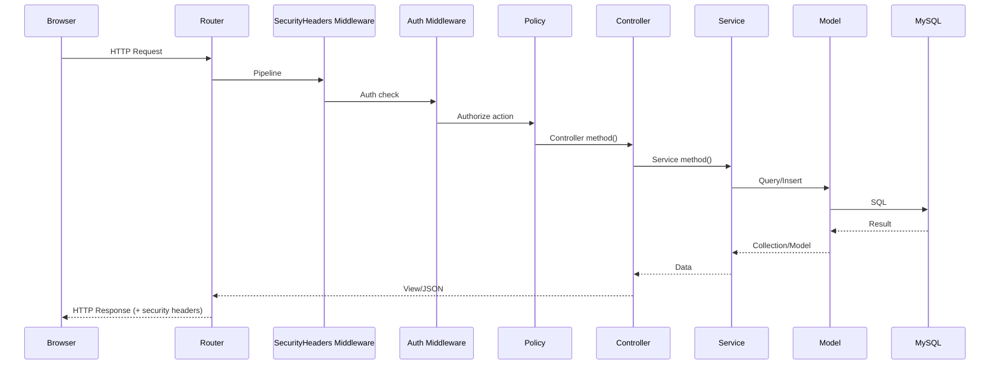
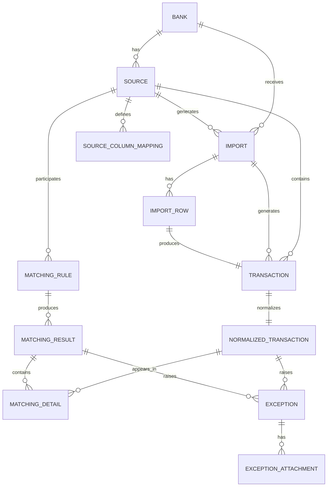

# 7. Architecture backend

## Point d'entrée

| Fichier | Rôle |
|---------|------|
| `public/index.php` | Bootstrap HTTP Laravel |
| `bootstrap/app.php` | Configuration application Laravel 12 |

## Cycle d'une requête HTTP



## Fichiers de configuration backend

| Fichier | Contenu |
|---------|---------|
| `config/app.php` | App name, env, debug, timezone, locale, cipher |
| `config/auth.php` | Guards, providers, passwords (Breeze) |
| `config/database.php` | Connexions MySQL, SQLite, PostgreSQL, etc. |
| `config/queue.php` | Drivers queue (database, redis, sync...) |
| `config/cache.php` | Stores cache (database, redis, file...) |
| `config/session.php` | Driver session (database), lifetime 120min |
| `config/filesystems.php` | Disks local, public, s3 |
| `config/mail.php` | Mailers (log, smtp, ses, postmark...) |
| `config/logging.php` | Canaux log (stack, single, daily...) |
| `config/matching.php` | Chunk size matching (1000) |
| `config/imports.php` | Chunk size imports (500) |
| `config/excel.php` | Config Maatwebsite/Excel |
| `config/permission.php` | Config Spatie Permission |

## Contrôleurs

### Organisation

```
Http/Controllers/
├── Controller.php                    # Base abstract
├── DashboardController.php           # KPIs dashboard
├── ProfileController.php             # CRUD profil
├── NotificationController.php        # Centre notifications
├── Auth/                             # Authentification Breeze
│   ├── AuthenticatedSessionController.php
│   ├── RegisteredUserController.php
│   ├── NewPasswordController.php
│   └── ...
└── Admin/                            # Module admin
    ├── BankController.php            # CRUD banques
    ├── SourceController.php          # CRUD sources
    ├── SourceMappingController.php   # Mapping colonnes
    ├── CurrencyController.php        # CRUD devises
    ├── HolidayController.php         # CRUD jours fériés
    ├── SettingController.php         # CRUD paramètres
    ├── UserController.php            # CRUD utilisateurs
    ├── RoleController.php            # CRUD rôles
    ├── AuditLogController.php        # Lecture audit
    ├── ImportController.php          # Upload + traitement
    ├── MatchingRuleController.php    # CRUD règles + run
    ├── MatchingResultController.php  # Lecture + export
    ├── ReconciliationController.php  # Rapprochement manuel
    ├── ExceptionController.php       # Lecture + résolution
    ├── ExceptionAttachmentController.php  # Pièces jointes
    └── SearchController.php          # Recherche multicritère
```

### Responsabilités contrôleur

1. Extraire les paramètres de la requête
2. Déléguer aux services métier
3. Retourner une vue (Blade) ou JSON (DataTables)
4. Gérer les redirections flash

**Exemple typique :**

```php
// app/Http/Controllers/Admin/ImportController.php

public function store(
    StoreImportRequest $request,
    ImportRowReaderFactory $readerFactory,
    MappingEngine $mapping
): RedirectResponse {
    $import = Import::create([...]);
    $reader = $readerFactory->make($import->source);
    $missing = $mapping->validateHeaders($reader->headers($path), $mappings);
    if (!empty($missing)) {
        return redirect()->route('admin.sources.mappings.edit', [...]);
    }
    ProcessImportJob::dispatch($import->id);
    return redirect()->route('admin.imports.show', $import)
        ->with('success', 'Import launched');
}
```

## Services métier

### DashboardMetricsService

**Fichier :** `app/Services/DashboardMetricsService.php`

| Méthode | Retour | Description |
|---------|--------|-------------|
| `importStats()` | array | Groupés par statut, sommes lignes |
| `matchingStats()` | array | Compte résultats par statut |
| `exceptionStats()` | array | Groupés par type/statut, compteur ouvert |
| `transactionVolumeBySource()` | array | Volume + montants par source |
| `dailyTransactionTrend(int $days)` | array | Tendance journalière (zero-filled) |
| `totalTransactions()` | int | Compteur total |
| `activeSourceCount()` | int | Compteur sources actives |

> **Cache :** 5 minutes via `Cache::remember`

### MappingEngine

**Fichier :** `app/Services/Import/MappingEngine.php`

| Méthode | Retour | Description |
|---------|--------|-------------|
| `transformRow(array $row, Collection $mappings)` | array | Applique la chaîne de transformation |
| `validateHeaders(array $fileHeaders, Collection $mappings)` | array | Colonnes requises manquantes |

**Chaîne de transformation :**

```
Raw Row → [Trim] → [StripPrefixChars] → [ZeroPad] → [DateParse] → Transformed Row
```

Chaque `SourceColumnMapping` définit un `target_field`, un `source_column` et un `transform` (tableau d'étapes).

### TransactionNormalizer

**Fichier :** `app/Services/Import/TransactionNormalizer.php`

| Méthode | Retour | Description |
|---------|--------|-------------|
| `buildTransactionRow(array $transformed, Source $source, Import $import, int $rowNumber)` | array | Construit la ligne `transactions` |
| `computeNormalizedSnapshot(array $tx)` | array | Calcule les champs normalisés (reference, amount, date, dedup_hash) |
| `buildNormalizedRow(int $txId, array $snapshot, int $sourceId)` | array | Construit la ligne `normalized_transactions` |

### TransformRegistry

**Fichier :** `app/Services/Import/TransformRegistry.php`

Factory résolvant les primitives de transformation par clé :

```php
public function make(string $key): TransformPrimitive
```

### ImportRowReaderFactory

**Fichier :** `app/Services/Import/Readers/ImportRowReaderFactory.php`

| Méthode | Retour | Description |
|---------|--------|-------------|
| `make(Source $source)` | `ImportRowReader` | Retourne CsvRowReader ou XlsxRowReader selon `file_type` |

### CsvRowReader / XlsxRowReader

| Méthode | Retour | Description |
|---------|--------|-------------|
| `headers(string $path, array $config)` | array | Extrait les en-têtes du fichier |
| `read(string $path, array $config)` | Generator | Itérateur sur les lignes (lazy) |

### Primitives de transformation (Transforms/)

Toutes implémentent `TransformPrimitive` (`app/Contracts/TransformPrimitive.php`) :

| Fichier | Clé | Description |
|---------|-----|-------------|
| `TrimTransform.php` | `trim` | Supprime espaces, null si vide |
| `StripPrefixCharsTransform.php` | `strip_prefix_chars` | Supprime préfixe configuré (B, b) |
| `FixedWidthMillimesTransform.php` | `fixed_width_millimes` | Trim + cast millimes |
| `DecimalStringToMillimesTransform.php` | `decimal_string_to_millimes` | String décimal → millimes |
| `DateParseTransform.php` | `date_parse` | Parse date selon format |
| `SubstringAfterNthDelimiterTransform.php` | `substring_after_nth_delimiter` | Sous-chaine après Nième délimiteur |
| `ZeroPadTransform.php` | `zero_pad` | Pad avec zéros à longueur fixe |
| `RightCharsTransform.php` | `right_chars` | Extrait les N derniers caractères |

### RuleMatcher

**Fichier :** `app/Services/Matching/RuleMatcher.php`

| Méthode | Retour | Description |
|---------|--------|-------------|
| `match(MatchingRule $rule, string $batchReference)` | `MatchingRunSummary` | Exécute une règle de matching |

**Algorithme :**
1. Récupère les transactions normalisées des deux sources
2. Groupe par clé primaire (reference/num_autorisation)
3. Pour chaque groupe, vérifie les champs de vérification (amount, date)
4. Applique la branche de tolérance :
   - Exact → Matched (confidence 100%)
   - Tolérance consommée → Partial (confidence 85%)
   - Hors tolérance → Conflict + Exception
   - Aucun signal → no_signal
5. Persiste `MatchingResult` + `MatchingDetails`

### DuplicateDetector

**Fichier :** `app/Services/Matching/DuplicateDetector.php`

| Méthode | Retour | Description |
|---------|--------|-------------|
| `scan(?int $sourceId)` | `DuplicateScanSummary` | Détecte doublons par `dedup_hash` |

### UnmatchedSweeper

**Fichier :** `app/Services/Matching/UnmatchedSweeper.php`

| Méthode | Retour | Description |
|---------|--------|-------------|
| `sweep(?int $sourceId)` | int | Crée exceptions Unmatched pour transactions sans match |

### ConfidenceScorer

**Fichier :** `app/Services/Matching/ConfidenceScorer.php`

| Méthode | Retour | Description |
|---------|--------|-------------|
| `score(bool $amountMatch, bool $dateMatch)` | float | 100.0 si exact, 85.0 si partiel |

### AuditLogService

**Fichier :** `app/Services/AuditLogService.php`

| Méthode | Retour | Description |
|---------|--------|-------------|
| `logModelEvent(string $event, Model $model, ?array $old, ?array $new)` | void | Log modification modèle |
| `logEvent(string $event, array $data)` | void | Log événement générique (auth) |

### SettingsService

**Fichier :** `app/Services/SettingsService.php`

| Méthode | Retour | Description |
|---------|--------|-------------|
| `get(string $group, string $key, mixed $default)` | mixed | Lecture paramètre (cache forever) |
| `set(string $group, string $key, mixed $value)` | void | Écriture paramètre |

## Modèles Eloquent

### Relations principales



### Accès aux modèles

| Modèle | Table | Clé primaire | Soft Deletes | Audit |
|--------|-------|--------------|--------------|-------|
| `User` | `users` | id | ✅ | ✅ |
| `Bank` | `banks` | id | ✅ | ✅ |
| `Source` | `sources` | id | ✅ | ✅ |
| `Currency` | `currencies` | id | ✅ | ✅ |
| `Holiday` | `holidays` | id | ✅ | ✅ |
| `Setting` | `settings` | id | ✅ | ✅ |
| `Import` | `imports` | id | ✅ | ✅ |
| `ImportRow` | `import_rows` | id | ✅ | ✅ |
| `Transaction` | `transactions` | id | ✅ | ✅ |
| `NormalizedTransaction` | `normalized_transactions` | id | ✅ | ✅ |
| `MatchingRule` | `matching_rules` | id | ✅ | ✅ |
| `MatchingResult` | `matching_results` | id | ✅ | ✅ |
| `MatchingDetail` | `matching_details` | id | ❌ | ❌ |
| `MatchingExport` | `matching_exports` | id | ✅ | ✅ |
| `ExceptionRecord` | `exceptions` | id | ✅ | ✅ |
| `ExceptionAttachment` | `exception_attachments` | id | ✅ | ✅ |
| `AuditLog` | `audit_logs` | id | ❌ | ❌ |
| `SourceColumnMapping` | `source_column_mappings` | id | ✅ | ✅ |

## Validation

Les Form Requests valident les données entrantes :

| Fichier | Usage |
|---------|-------|
| `StoreBankRequest.php` | Création banque |
| `UpdateBankRequest.php` | Modification banque |
| `StoreSourceRequest.php` | Création source |
| `UpdateSourceRequest.php` | Modification source |
| `UpdateSourceMappingRequest.php` | Sauvegarde mapping |
| `StoreImportRequest.php` | Upload fichier |
| `StoreMatchingRuleRequest.php` | Création règle |
| `StoreUserRequest.php` | Création utilisateur |
| `StoreRoleRequest.php` | Création rôle |
| `StoreExceptionAttachmentRequest.php` | Upload pièce jointe |

## Middleware

| Fichier | Rôle | Application |
|---------|------|-------------|
| `SecurityHeaders.php` | Headers sécurité (CSP, HSTS, X-Frame-Options) | Global (toutes requêtes) |
| `auth` | Authentification requise | Routes protégées |
| `verified` | Email vérifié | Routes admin |
| `guest` | Invité uniquement | Routes auth |
| `throttle:expensive-actions` | Rate limit 10/min | Run rule, export |

## Exceptions

| Fichier | Exception | Déclenchement |
|---------|-----------|---------------|
| `TransformException.php` | `TransformException` | Échec transformation primitive |
| `RowTransformException.php` | `RowTransformException` | Échec transformation ligne |
| `MissingRequiredFieldException.php` | `MissingRequiredFieldException` | Champ requis manquant |

## Gestion des erreurs

Les erreurs sont gérées par :
1. **Try/catch** dans les jobs pour isoler les erreurs par ligne
2. **Form Requests** pour les erreurs de validation (retour automatique avec errors)
3. **Policies** pour les erreurs 403 (non autorisé)
4. **Handler Laravel** par défaut pour les erreurs 500, 404, etc.

## Logging

| Niveau | Usage |
|--------|-------|
| `debug` | Non utilisé explicitement |
| `info` | Non utilisé explicitement |
| `warning` | Non utilisé explicitement |
| `error` | Jobs en échec (potentiel) |

Les logs d'audit sont persistés en base via `audit_logs`.
