# 9. Modèle de données

## Diagramme entité-relation

```mermaid
erDiagram
    BANK {
        int id PK
        string code UK
        string name
        string swift_code
        boolean is_active
        timestamp created_at
        timestamp updated_at
        timestamp deleted_at
    }

    CURRENCY {
        int id PK
        string iso_code UK
        string name
        string symbol
        int decimal_places
        boolean is_active
        timestamp created_at
        timestamp updated_at
        timestamp deleted_at
    }

    SOURCE {
        int id PK
        string code UK
        string name
        int bank_id FK
        string file_type
        int default_currency_id FK
        boolean is_active
        string description
        json config
        timestamp created_at
        timestamp updated_at
        timestamp deleted_at
    }

    SOURCE_COLUMN_MAPPING {
        int id PK
        int source_id FK
        string target_field
        string source_column
        json transform
        boolean is_required
        int sort_order
        timestamp created_at
        timestamp updated_at
        timestamp deleted_at
    }

    IMPORT {
        int id PK
        int source_id FK
        int bank_id FK
        string original_filename
        string stored_path
        string file_hash
        string mime_type
        int size_bytes
        string status
        int total_rows
        int processed_rows
        int success_rows
        int error_rows
        timestamp started_at
        timestamp finished_at
        timestamp job_dispatched_at
        json error_summary
        json meta
        int imported_by FK
        timestamp created_at
        timestamp updated_at
        timestamp deleted_at
    }

    IMPORT_ROW {
        int id PK
        int import_id FK
        int row_number
        json raw_data
        json transformed_data
        json normalized_data
        string status
        string error_message
        timestamp created_at
        timestamp updated_at
        timestamp deleted_at
    }

    TRANSACTION {
        int id PK
        int import_id FK
        int import_row_id FK
        int source_id FK
        int bank_id FK
        int currency_id FK
        string external_reference
        date transaction_date
        datetime transaction_datetime
        int amount_millimes
        string canal
        json raw_payload
        timestamp created_at
        timestamp updated_at
        timestamp deleted_at
    }

    NORMALIZED_TRANSACTION {
        int id PK
        int transaction_id FK
        string normalized_reference
        int normalized_amount_millimes
        date normalized_date
        string dedup_hash
        string matching_status
        timestamp created_at
        timestamp updated_at
        timestamp deleted_at
    }

    MATCHING_RULE {
        int id PK
        string name
        string description
        int source_a_id FK
        int source_b_id FK
        string cardinality
        int priority
        boolean is_active
        json criteria
        timestamp created_at
        timestamp updated_at
        timestamp deleted_at
    }

    MATCHING_RESULT {
        int id PK
        int matching_rule_id FK
        string batch_reference
        string status
        decimal confidence_score
        int matched_by FK
        timestamp matched_at
        string notes
        timestamp created_at
        timestamp updated_at
        timestamp deleted_at
    }

    MATCHING_DETAIL {
        int id PK
        int matching_result_id FK
        int normalized_transaction_id FK
        string side
        timestamp created_at
        timestamp updated_at
    }

    MATCHING_EXPORT {
        int id PK
        int user_id FK
        string format
        string status
        string file_path
        string download_token
        json filters
        string error_message
        timestamp completed_at
        timestamp created_at
        timestamp updated_at
        timestamp deleted_at
    }

    EXCEPTION {
        int id PK
        int normalized_transaction_id FK
        int matching_result_id FK
        string type
        string status
        int assigned_to FK
        string resolution_comment
        int resolved_by FK
        timestamp resolved_at
        timestamp created_at
        timestamp updated_at
        timestamp deleted_at
    }

    EXCEPTION_ATTACHMENT {
        int id PK
        int exception_id FK
        string disk
        string path
        string original_name
        string mime_type
        int size_bytes
        int uploaded_by FK
        timestamp created_at
        timestamp updated_at
        timestamp deleted_at
    }

    AUDIT_LOG {
        int id PK
        int user_id FK
        string event
        string auditable_type
        int auditable_id
        json old_values
        json new_values
        string url
        string ip_address
        string user_agent
        string tags
        timestamp created_at
    }

    USER {
        int id PK
        string name
        string prenom
        string nom
        string matricule UK
        string email UK
        string portable
        timestamp email_verified_at
        string password
        boolean is_active
        timestamp last_login_at
        timestamp created_at
        timestamp updated_at
        timestamp deleted_at
    }

    HOLIDAY {
        int id PK
        date holiday_date UK
        string name
        string country_code UK
        boolean is_recurring_yearly
        timestamp created_at
        timestamp updated_at
        timestamp deleted_at
    }

    SETTING {
        int id PK
        string group
        string key
        json value
        string type
        string description
        boolean is_editable
        timestamp created_at
        timestamp updated_at
        timestamp deleted_at
    }

    BANK ||--o{ SOURCE : "has many"
    BANK ||--o{ IMPORT : "has many"
    CURRENCY ||--o{ SOURCE : "default currency"
    CURRENCY ||--o{ TRANSACTION : "has many"
    SOURCE ||--o{ IMPORT : "has many"
    SOURCE ||--o{ TRANSACTION : "has many"
    SOURCE ||--o{ SOURCE_COLUMN_MAPPING : "has many"
    SOURCE ||--o{ MATCHING_RULE : "source_a or source_b"
    IMPORT ||--o{ IMPORT_ROW : "has many"
    IMPORT ||--o{ TRANSACTION : "has many"
    IMPORT_ROW ||--|| TRANSACTION : "produces"
    TRANSACTION ||--|| NORMALIZED_TRANSACTION : "normalizes to"
    NORMALIZED_TRANSACTION ||--o{ MATCHING_DETAIL : "appears in"
    NORMALIZED_TRANSACTION ||--o{ EXCEPTION : "raises"
    MATCHING_RULE ||--o{ MATCHING_RESULT : "produces"
    MATCHING_RESULT ||--o{ MATCHING_DETAIL : "contains"
    MATCHING_RESULT ||--o{ EXCEPTION : "raises"
    EXCEPTION ||--o{ EXCEPTION_ATTACHMENT : "has many"
    USER ||--o{ IMPORT : "imports"
    USER ||--o{ MATCHING_RESULT : "matches"
    USER ||--o{ MATCHING_EXPORT : "exports"
    USER ||--o{ EXCEPTION : "resolves"
    USER ||--o{ AUDIT_LOG : "generates"
```

## Tables principales

### `users`

| Colonne | Type | Nullable | Description |
|---------|------|----------|-------------|
| `id` | bigint PK | Non | Identifiant |
| `name` | string | Non | Nom complet |
| `prenom` | string | Oui | Prénom |
| `nom` | string | Oui | Nom de famille |
| `matricule` | string | Oui | Matricule employé (unique) |
| `email` | string | Non | Email (unique) |
| `portable` | string | Oui | Téléphone portable |
| `email_verified_at` | datetime | Oui | Date vérification email |
| `password` | string | Non | Hash mot de passe |
| `is_active` | boolean | Non | Compte actif |
| `last_login_at` | datetime | Oui | Dernière connexion |
| `remember_token` | string | Oui | Token remember me |
| `created_by` | bigint FK | Oui | Créateur (userstamps) |
| `updated_by` | bigint FK | Oui | Dernier modificateur |
| `created_at` | timestamp | Non | Date création |
| `updated_at` | timestamp | Non | Date modification |
| `deleted_at` | timestamp | Oui | Soft delete |

**Relations Spatie :**
- `roles()` : BelongsToMany `Role`
- `permissions()` : BelongsToMany `Permission`

---

### `sources`

| Colonne | Type | Nullable | Description |
|---------|------|----------|-------------|
| `id` | bigint PK | Non | Identifiant |
| `code` | string | Non | Code unique (ALPHA, BNA, WEB, SMT) |
| `name` | string | Non | Nom affiché |
| `bank_id` | bigint FK | Oui | Banque associée |
| `file_type` | string | Non | Type fichier (csv, xls, xlsx) |
| `default_currency_id` | bigint FK | Oui | Devise par défaut |
| `is_active` | boolean | Non | Source active |
| `description` | text | Oui | Description |
| `config` | json | Oui | Configuration additionnelle |

---

### `imports`

| Colonne | Type | Nullable | Description |
|---------|------|----------|-------------|
| `id` | bigint PK | Non | Identifiant |
| `source_id` | bigint FK | Non | Source associée |
| `bank_id` | bigint FK | Oui | Banque |
| `original_filename` | string | Non | Nom fichier original |
| `stored_path` | string | Non | Chemin stockage |
| `file_hash` | string | Non | Hash SHA256 fichier |
| `mime_type` | string | Non | Type MIME |
| `size_bytes` | int | Non | Taille en octets |
| `status` | string | Non | pending/processing/completed/failed/partially_completed |
| `total_rows` | int | Oui | Nombre total lignes |
| `processed_rows` | int | Oui | Lignes traitées |
| `success_rows` | int | Oui | Lignes réussies |
| `error_rows` | int | Oui | Lignes en erreur |
| `started_at` | datetime | Oui | Début traitement |
| `finished_at` | datetime | Oui | Fin traitement |
| `job_dispatched_at` | datetime | Oui | Dispatch job |
| `error_summary` | json | Oui | Résumé erreurs |
| `meta` | json | Oui | Métadonnées additionnelles |
| `imported_by` | bigint FK | Oui | Utilisateur |

---

### `transactions`

| Colonne | Type | Nullable | Description |
|---------|------|----------|-------------|
| `id` | bigint PK | Non | Identifiant |
| `import_id` | bigint FK | Non | Import source |
| `import_row_id` | bigint FK | Oui | Ligne d'import |
| `source_id` | bigint FK | Non | Source |
| `bank_id` | bigint FK | Oui | Banque |
| `currency_id` | bigint FK | Oui | Devise |
| `external_reference` | string | Oui | Référence externe |
| `transaction_date` | date | Oui | Date transaction |
| `transaction_datetime` | datetime | Oui | Date/heure transaction |
| `amount_millimes` | int | Non | Montant en millimes (1 TND = 1000 millimes) |
| `canal` | string | Oui | Canal de paiement |
| `raw_payload` | json | Oui | Données brutes additionnelles |

---

### `normalized_transactions`

| Colonne | Type | Nullable | Description |
|---------|------|----------|-------------|
| `id` | bigint PK | Non | Identifiant |
| `transaction_id` | bigint FK | Non | Transaction source |
| `normalized_reference` | string | Oui | Référence normalisée (pour matching) |
| `normalized_amount_millimes` | int | Oui | Montant normalisé |
| `normalized_date` | date | Oui | Date normalisée |
| `dedup_hash` | string | Oui | Hash déduplication |
| `matching_status` | string | Non | unmatched/matched/partial/conflict/ignored |

---

### `matching_rules`

| Colonne | Type | Nullable | Description |
|---------|------|----------|-------------|
| `id` | bigint PK | Non | Identifiant |
| `name` | string | Non | Nom de la règle |
| `description` | text | Oui | Description |
| `source_a_id` | bigint FK | Non | Source côté A |
| `source_b_id` | bigint FK | Non | Source côté B |
| `cardinality` | string | Non | one_to_one/one_to_many/many_to_one/many_to_many |
| `priority` | int | Non | Priorité d'exécution |
| `is_active` | boolean | Non | Règle active |
| `criteria` | json | Oui | Critères de tolérance (amount, days, excluded_status_raw) |

---

### `matching_results`

| Colonne | Type | Nullable | Description |
|---------|------|----------|-------------|
| `id` | bigint PK | Non | Identifiant |
| `matching_rule_id` | bigint FK | Oui | Règle (null si manuel) |
| `batch_reference` | string | Oui | Référence de batch |
| `status` | string | Non | matched/partial/conflict/rejected |
| `confidence_score` | decimal(5,2) | Oui | Score de confiance (0-100) |
| `matched_by` | bigint FK | Oui | Utilisateur (null si auto) |
| `matched_at` | datetime | Oui | Date matching |
| `notes` | text | Oui | Notes |

---

### `exceptions`

| Colonne | Type | Nullable | Description |
|---------|------|----------|-------------|
| `id` | bigint PK | Non | Identifiant |
| `normalized_transaction_id` | bigint FK | Oui | Transaction concernée |
| `matching_result_id` | bigint FK | Oui | Résultat concerné |
| `type` | string | Non | unmatched/amount_mismatch/date_mismatch/duplicate/orphan/conflict |
| `status` | string | Non | open/in_review/resolved/ignored |
| `assigned_to` | bigint FK | Oui | Utilisateur assigné |
| `resolution_comment` | text | Oui | Commentaire résolution |
| `resolved_by` | bigint FK | Oui | Utilisateur résolveur |
| `resolved_at` | datetime | Oui | Date résolution |

---

### `audit_logs`

| Colonne | Type | Nullable | Description |
|---------|------|----------|-------------|
| `id` | bigint PK | Non | Identifiant |
| `user_id` | bigint FK | Oui | Utilisateur |
| `event` | string | Non | Type événement (created/updated/deleted/login/logout/login_failed) |
| `auditable_type` | string | Oui | Classe modèle (polymorphique) |
| `auditable_id` | bigint | Oui | ID modèle |
| `old_values` | json | Oui | Anciennes valeurs |
| `new_values` | json | Oui | Nouvelles valeurs |
| `url` | string | Oui | URL requête |
| `ip_address` | string | Oui | IP |
| `user_agent` | text | Oui | User agent |
| `tags` | string | Oui | Tags additionnels |

---

### `source_column_mappings`

| Colonne | Type | Nullable | Description |
|---------|------|----------|-------------|
| `id` | bigint PK | Non | Identifiant |
| `source_id` | bigint FK | Non | Source |
| `target_field` | string | Non | Champ cible (reference, amount, date, etc.) |
| `source_column` | string | Non | Nom colonne dans le fichier source |
| `transform` | json | Oui | Chaîne de transformations |
| `is_required` | boolean | Non | Champ requis |
| `sort_order` | int | Non | Ordre d'application |

## Tables Spatie Permission

| Table | Description |
|-------|-------------|
| `roles` | Rôles utilisateur |
| `permissions` | Permissions |
| `model_has_roles` | Association utilisateur → rôle |
| `model_has_permissions` | Association utilisateur → permission directe |
| `role_has_permissions` | Association rôle → permission |

## Tables Laravel

| Table | Description |
|-------|-------------|
| `sessions` | Sessions utilisateur (driver database) |
| `jobs` | File d'attente jobs (driver database) |
| `job_batches` | Batchs de jobs |
| `failed_jobs` | Jobs échoués |
| `cache` | Cache (driver database) |
| `cache_locks` | Verrous cache |
| `notifications` | Notifications base de données |

## Index et contraintes notables

| Table | Contrainte | Description |
|-------|------------|-------------|
| `users` | UNIQUE `email` | Email unique |
| `users` | UNIQUE `matricule` | Matricule unique |
| `banks` | UNIQUE `code` | Code banque unique |
| `sources` | UNIQUE `code` | Code source unique |
| `currencies` | UNIQUE `iso_code` | Code ISO unique |
| `holidays` | UNIQUE `holiday_date,country_code` | Pas deux jours fériés même date/pays |
| `source_column_mappings` | UNIQUE `source_id,target_field` | Un mapping par champ cible par source |

## Enums et valeurs constantes

### ImportStatus
- `pending` — En attente
- `processing` — En cours
- `completed` — Terminé avec succès
- `failed` — Échoué
- `partially_completed` — Partiellement terminé

### MatchingStatus (NormalizedTransaction)
- `unmatched` — Non apparié
- `matched` — Apparié
- `partial` — Apparié partiellement
- `conflict` — Conflit détecté
- `ignored` — Ignoré

### MatchingResultStatus
- `matched` — Apparié
- `partial` — Partiel
- `conflict` — Conflit
- `rejected` — Rejeté

### MatchingCardinality
- `one_to_one` — 1:1
- `one_to_many` — 1:N
- `many_to_one` — N:1
- `many_to_many` — N:N

### ExceptionType
- `unmatched` — Non apparié
- `amount_mismatch` — Montant différent
- `date_mismatch` — Date différente
- `duplicate` — Doublon
- `orphan` — Orphelin
- `conflict` — Conflit

### ExceptionStatus
- `open` — Ouvert
- `in_review` — En revue
- `resolved` — Résolu
- `ignored` — Ignoré

### MappingTargetField
- `reference` — Référence
- `num_autorisation` — Numéro autorisation
- `amount` — Montant
- `date` — Date
- `datetime` — Date/heure
- `canal` — Canal
- `currency_code` — Code devise
- `status_raw` — Statut brut
- `secondary_reference` — Référence secondaire
- `session` — Session (non-core, dans raw_payload)
