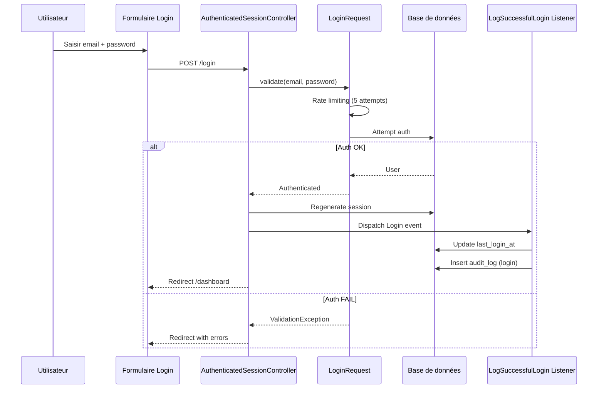

# 10. Authentification, rôles et permissions

## Mécanisme d'authentification

| Aspect | Détail |
|--------|--------|
| **Driver** | Session Laravel (Breeze) |
| **Storage** | Base de données (`sessions` table) |
| **Lifetime** | 120 minutes |
| **Hash** | Bcrypt (12 rounds production, 4 rounds test) |
| **Email verification** | Activée (requise pour admin routes) |
| **Remember me** | Supporté |

### Fichiers clés

| Fichier | Rôle |
|---------|------|
| `routes/auth.php` | Routes auth Breeze |
| `app/Http/Controllers/Auth/AuthenticatedSessionController.php` | Login/Logout |
| `app/Http/Controllers/Auth/RegisteredUserController.php` | Inscription |
| `app/Http/Controllers/Auth/NewPasswordController.php` | Reset password |
| `app/Http/Requests/Auth/LoginRequest.php` | Validation login + rate limit |
| `app/Http/Middleware/SecurityHeaders.php` | Headers sécurité |

### Workflow Login



### Logout

```
POST /logout
→ AuthenticatedSessionController@destroy
→ LogSuccessfulLogout listener → audit_log (logout)
→ Session invalidate + regenerate
→ Redirect /login
```

### Inscription

```
GET /register → RegisteredUserController@create
POST /register → RegisteredUserController@store
→ Création user
→ Event Login (auto-login)
→ Redirect /dashboard
```

### Reset Password

```
GET /forgot-password → PasswordResetLinkController@create
POST /forgot-password → PasswordResetLinkController@store
→ Envoi email (log en dev)
GET /reset-password/{token} → NewPasswordController@create
POST /reset-password → NewPasswordController@store
→ Validation + update password
→ Redirect /login
```

### Rate Limiting Auth

| Route | Limite |
|-------|--------|
| `/login` | 5 attempts |
| `/register` | 6 attempts |
| `/forgot-password` | 6 attempts |
| `/reset-password` | 6 attempts |

## Rôles

### Définition

Les rôles sont gérés via `spatie/laravel-permission` et stockés dans la table `roles`.

### Rôles identifiés

D'après les fichiers de test (`tests/Feature/RolePermissionTest.php`) et seeders :

| Rôle | Description |
|------|-------------|
| `super-admin` | Accès total, bypass permissions |
| `admin` | Accès complet admin |
| `director` | Lecture seule + audit |
| `department-head` | CRUD métier + utilisateurs |
| `execution-agent` | Rapprochement manuel + exceptions |
| `auditor` | Lecture seule + audit |
| `operator` | Opérations quotidiennes |

### Déclaration des rôles

**Fichier :** `database/seeders/RolePermissionSeeder.php`

Les rôles sont créés via :
```php
Role::create(['name' => 'admin', 'guard_name' => 'web']);
```

### Modèle User

**Fichier :** `app/Models/User.php`

```php
use Spatie\Permission\Traits\HasRoles;

class User extends Authenticatable
{
    use HasRoles, SoftDeletes, HasFactory, Notifiable, HasUserstamps, Audatable;
    
    protected $fillable = [
        'name', 'prenom', 'nom', 'matricule', 'email', 
        'portable', 'password', 'is_active',
    ];
}
```

## Permissions

### Structure

Les permissions sont organisées par module métier. D'après les contrôleurs et policies, les permissions utilisées sont :

| Module | Permissions |
|--------|-------------|
| **Banks** | `banks.viewAny`, `banks.view`, `banks.create`, `banks.update`, `banks.delete` |
| **Sources** | `sources.viewAny`, `sources.view`, `sources.create`, `sources.update`, `sources.delete` |
| **Currencies** | `currencies.viewAny`, `currencies.view`, `currencies.create`, `currencies.update`, `currencies.delete` |
| **Holidays** | `holidays.viewAny`, `holidays.view`, `holidays.create`, `holidays.update`, `holidays.delete` |
| **Settings** | `settings.viewAny`, `settings.view`, `settings.update` |
| **Users** | `users.viewAny`, `users.view`, `users.create`, `users.update`, `users.delete` |
| **Roles** | `roles.viewAny`, `roles.view`, `roles.create`, `roles.update`, `roles.delete` |
| **Audit Logs** | `audit-logs.viewAny`, `audit-logs.view` |
| **Imports** | `imports.viewAny`, `imports.view`, `imports.create`, `imports.delete` |
| **Matching Rules** | `matching-rules.viewAny`, `matching-rules.create`, `matching-rules.update`, `matching-rules.delete` |
| **Matching Results** | `matching-results.viewAny`, `matching-results.view`, `matching-results.create`, `matching-results.delete` |
| **Exceptions** | `exceptions.viewAny`, `exceptions.view`, `exceptions.update` |
| **Search** | `search.viewAny` |

### Attribution des permissions aux rôles

**Fichier :** `database/seeders/RolePermissionSeeder.php`

```php
$admin->givePermissionTo([...toutes...]);
$auditor->givePermissionTo([...lecture seule...]);
// etc.
```

## Policies

### Fichiers

| Fichier | Modèle | Méthodes |
|---------|--------|----------|
| `app/Policies/BankPolicy.php` | `Bank` | viewAny, view, create, update, delete, restore, forceDelete |
| `app/Policies/SourcePolicy.php` | `Source` | idem |
| `app/Policies/CurrencyPolicy.php` | `Currency` | idem |
| `app/Policies/HolidayPolicy.php` | `Holiday` | idem |
| `app/Policies/SettingPolicy.php` | `Setting` | viewAny, view, update |
| `app/Policies/UserPolicy.php` | `User` | viewAny, view, create, update, delete |
| `app/Policies/RolePolicy.php` | `Role` | viewAny, view, create, update, delete |
| `app/Policies/AuditLogPolicy.php` | `AuditLog` | viewAny, view |
| `app/Policies/ImportPolicy.php` | `Import` | viewAny, view, create, delete |
| `app/Policies/MatchingRulePolicy.php` | `MatchingRule` | viewAny, create, update, delete |
| `app/Policies/MatchingResultPolicy.php` | `MatchingResult` | viewAny, view, create, delete |
| `app/Policies/ExceptionPolicy.php` | `ExceptionRecord` | viewAny, view, update |

### Pattern des policies

```php
// Exemple BankPolicy::viewAny
public function viewAny(User $user): bool
{
    return $user->can('banks.viewAny');
}

// Exemple UserPolicy::delete (empêche auto-suppression)
public function delete(User $user, User $model): bool
{
    if ($user->id === $model->id) {
        return false; // Pas supprimer son propre compte
    }
    return $user->can('users.delete');
}
```

## Matrice de permissions

| Fonctionnalité | super-admin | admin | director | dept-head | exec-agent | auditor | operator |
|----------------|:-----------:|:-----:|:--------:|:---------:|:----------:|:-------:|:--------:|
| **Dashboard** | ✅ | ✅ | ✅ | ✅ | ✅ | ✅ | ✅ |
| **Recherche** | ✅ | ✅ | ✅ | ✅ | ✅ | ✅ | ✅ |
| **Imports - Voir** | ✅ | ✅ | ✅ | ✅ | ✅ | ✅ | ✅ |
| **Imports - Créer** | ✅ | ✅ | ❌ | ✅ | ❌ | ❌ | ✅ |
| **Imports - Supprimer** | ✅ | ✅ | ❌ | ✅ | ❌ | ❌ | ❌ |
| **Règles - Voir** | ✅ | ✅ | ✅ | ✅ | ✅ | ✅ | ✅ |
| **Règles - Créer** | ✅ | ✅ | ❌ | ✅ | ❌ | ❌ | ❌ |
| **Règles - Modifier** | ✅ | ✅ | ❌ | ✅ | ❌ | ❌ | ❌ |
| **Règles - Supprimer** | ✅ | ✅ | ❌ | ✅ | ❌ | ❌ | ❌ |
| **Résultats - Voir** | ✅ | ✅ | ✅ | ✅ | ✅ | ✅ | ✅ |
| **Résultats - Créer** | ✅ | ✅ | ❌ | ✅ | ✅ | ❌ | ✅ |
| **Résultats - Supprimer** | ✅ | ✅ | ❌ | ✅ | ❌ | ❌ | ❌ |
| **Rapprochement manuel** | ✅ | ✅ | ❌ | ✅ | ✅ | ❌ | ✅ |
| **Exceptions - Voir** | ✅ | ✅ | ✅ | ✅ | ✅ | ✅ | ✅ |
| **Exceptions - Modifier** | ✅ | ✅ | ❌ | ✅ | ✅ | ❌ | ✅ |
| **Banques - CRUD** | ✅ | ✅ | ❌ | ✅ | ❌ | ❌ | ❌ |
| **Sources - CRUD** | ✅ | ✅ | ❌ | ✅ | ❌ | ❌ | ❌ |
| **Devises - CRUD** | ✅ | ✅ | ❌ | ✅ | ❌ | ❌ | ❌ |
| **Jours fériés - CRUD** | ✅ | ✅ | ❌ | ✅ | ❌ | ❌ | ❌ |
| **Paramètres** | ✅ | ✅ | ❌ | ✅ | ❌ | ❌ | ❌ |
| **Utilisateurs - CRUD** | ✅ | ✅ | ❌ | ✅ | ❌ | ❌ | ❌ |
| **Rôles - CRUD** | ✅ | ✅ | ❌ | ✅ | ❌ | ❌ | ❌ |
| **Audit - Voir** | ✅ | ✅ | ✅ | ✅ | ❌ | ✅ | ❌ |

> **Note :** Cette matrice est déduite des patterns de code. Les permissions exactes sont définies dans `RolePermissionSeeder.php`.

## Guards et middlewares

| Guard | Usage |
|-------|-------|
| `web` | Guard par défaut (session) |

| Middleware | Routes | Description |
|------------|--------|-------------|
| `auth` | Admin routes | Utilisateur authentifié |
| `verified` | Admin routes | Email vérifié |
| `guest` | Auth routes | Invité uniquement |
| `throttle:expensive-actions` | Run rule, export | Rate limit 10/min |

## Bypass super-admin

Le rôle `super-admin` bypass toutes les vérifications de permission via Spatie Permission. Il a accès à toutes les fonctionnalités sans restriction.

## Gestion des sessions

| Paramètre | Valeur |
|-----------|--------|
| Driver | `database` |
| Table | `sessions` |
| Lifetime | 120 minutes |
| Encrypt | false (configurable) |
| Same-site | Non configuré (Lax par défaut) |
| Secure cookie | null (dépend de l'environnement) |

## Sécurité des mots de passe

| Paramètre | Valeur |
|-----------|--------|
| Algorithme | Bcrypt |
| Rounds (production) | 12 |
| Rounds (test) | 4 |
| Validation (création) | `Password::defaults()` (min 8 chars, mixed case, numbers, symbols) |
| Reset | Token unique, expiration configurable |
