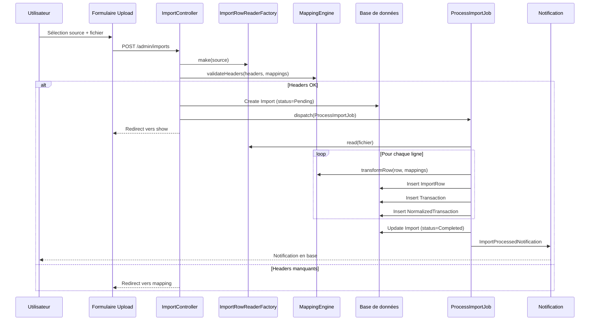
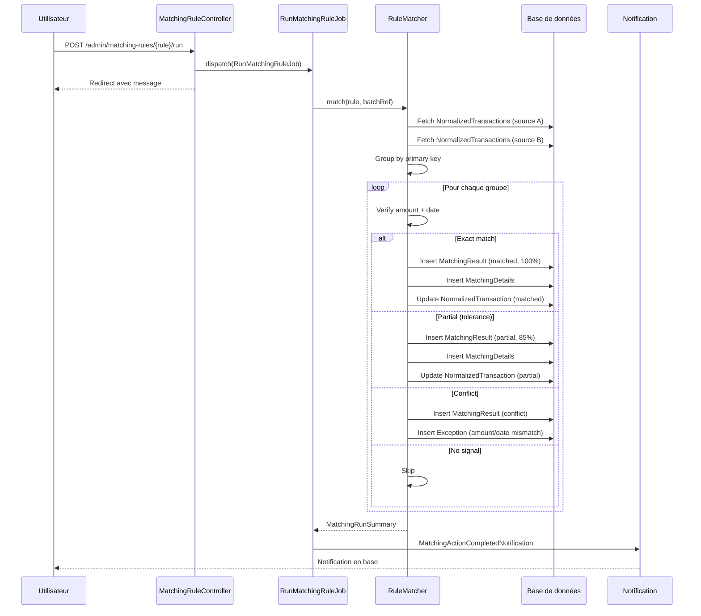
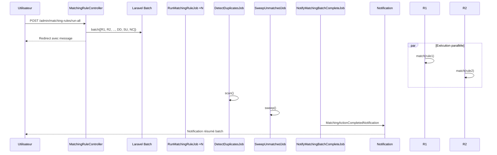
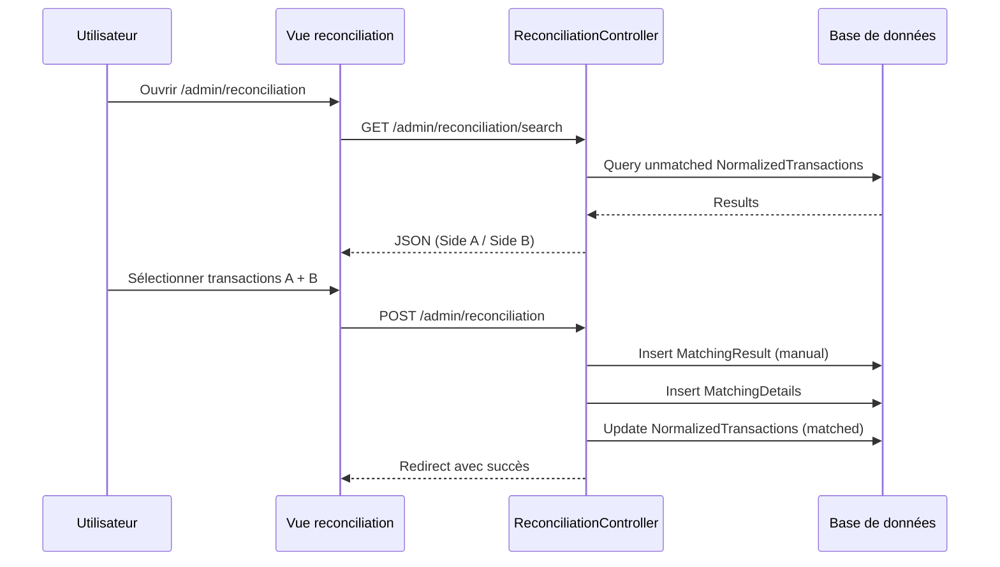
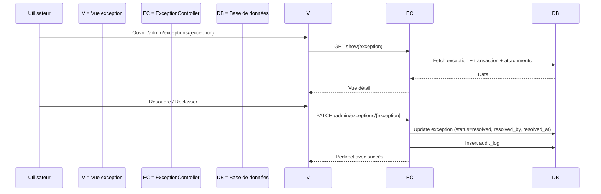

# 11. Workflows métier principaux

## 1. Import d'un fichier de paiement

### Description fonctionnelle

L'utilisateur upload un fichier CSV/XLSX provenant d'une banque (ALPHA, BNA, WEB/STEG, SMT). Le système valide les en-têtes, transforme les données, les normalise et les stocke en base.

### Diagramme de séquence

### Fichiers concernés

| Étape | Fichier | Méthode/Classe |
|-------|---------|----------------|
| Formulaire | `resources/views/admin/imports/create.blade.php` | - |
| Upload | `app/Http/Controllers/Admin/ImportController.php` | `store()` |
| Validation | `app/Http/Requests/StoreImportRequest.php` | `rules()` |
| Lecteur | `app/Services/Import/Readers/ImportRowReaderFactory.php` | `make()` |
| Validation headers | `app/Services/Import/MappingEngine.php` | `validateHeaders()` |
| Job | `app/Jobs/ProcessImportJob.php` | `handle()` |
| Transformation | `app/Services/Import/MappingEngine.php` | `transformRow()` |
| Normalisation | `app/Services/Import/TransactionNormalizer.php` | `buildTransactionRow()` |
| Notification | `app/Notifications/ImportProcessedNotification.php` | - |

### Entités modifiées

| Entité | Opération |
|--------|-----------|
| `imports` | INSERT |
| `import_rows` | INSERT (par ligne) |
| `transactions` | INSERT (par ligne) |
| `normalized_transactions` | INSERT (par ligne) |
| `notifications` | INSERT (à la fin) |

### Permissions

- `imports.create` — Pour uploader
- `imports.view` — Pour voir le détail

### Erreurs possibles

| Erreur | Cause | Gestion |
|--------|-------|---------|
| 422 Validation | Fichier manquant, extension invalide | Retour formulaire avec erreurs |
| Headers manquants | Colonnes requises absentes | Redirect vers mapping |
| Doublon détecté | Hash fichier identique | Warning en session |
| Job déjà en cours | Double dispatch | Message d'erreur |
| Erreur transformation | Données invalides dans une ligne | Ligne marquée Error, import continue |
| Erreur globale | Exception non catchée | Import marqué Failed |

---

## 2. Rapprochement automatique (matching)

### Description fonctionnelle

Le système exécute une règle de rapprochement qui compare les transactions normalisées de deux sources et crée des résultats (matched/partial/conflict) avec score de confiance.

### Diagramme de séquence

### Fichiers concernés

| Étape | Fichier | Méthode/Classe |
|-------|---------|----------------|
| Déclenchement | `app/Http/Controllers/Admin/MatchingRuleController.php` | `run()` |
| Job | `app/Jobs/RunMatchingRuleJob.php` | `handle()` |
| Moteur | `app/Services/Matching/RuleMatcher.php` | `match()` |
| Score | `app/Services/Matching/ConfidenceScorer.php` | `score()` |
| Notification | `app/Notifications/MatchingActionCompletedNotification.php` | - |

### Entités modifiées

| Entité | Opération |
|--------|-----------|
| `matching_results` | INSERT |
| `matching_details` | INSERT (par transaction appariée) |
| `normalized_transactions` | UPDATE (matching_status) |
| `exceptions` | INSERT (si conflit) |
| `notifications` | INSERT |

### Permissions

- `matching-rules.update` — Pour exécuter une règle

### Règles de matching disponibles

| Règle | Source A | Source B | Clé primaire | Vérification |
|-------|----------|----------|--------------|--------------|
| ALPHA-BNA | ALPHA | BNA | num_autorisation | amount, date |
| SMT-BNA | SMT | BNA | date\|amount (composite) | - |
| WEB-BNA | WEB | BNA | secondary_reference (recu_paie) vs num_autorisation | - |
| ALPHA-WEB | ALPHA | WEB | reference | num_autorisation vs secondary_reference |
| ALPHA-SMT | ALPHA | SMT | date\|amount (composite) | - |
| WEB-SMT | WEB | SMT | date\|amount (composite) | - |

---

## 3. Exécution batch (Lancer tout)

### Description fonctionnelle

L'utilisateur déclenche l'exécution de toutes les règles actives en une seule action, suivie de la détection des doublons et du balayage des orphelins.

### Diagramme de séquence

### Fichiers concernés

| Étape | Fichier | Méthode/Classe |
|-------|---------|----------------|
| Déclenchement | `app/Http/Controllers/Admin/MatchingRuleController.php` | `runAll()` |
| Job règle | `app/Jobs/RunMatchingRuleJob.php` | `handle()` |
| Job doublons | `app/Jobs/DetectDuplicatesJob.php` | `handle()` |
| Job orphelins | `app/Jobs/SweepUnmatchedJob.php` | `handle()` |
| Job notification | `app/Jobs/NotifyMatchingBatchCompleteJob.php` | `handle()` |
| Détection doublons | `app/Services/Matching/DuplicateDetector.php` | `scan()` |
| Balayage orphelins | `app/Services/Matching/UnmatchedSweeper.php` | `sweep()` |

### Permissions

- `matching-rules.update` — Pour lancer le batch
- Rate limit : 10/min (`throttle:expensive-actions`)

---

## 4. Rapprochement manuel

### Description fonctionnelle

L'utilisateur recherche des transactions non appariées, sélectionne des transactions côté A et côté B, et crée un appariement manuel.

### Diagramme de séquence

### Fichiers concernés

| Étape | Fichier | Méthode/Classe |
|-------|---------|----------------|
| Interface | `resources/views/admin/reconciliation/index.blade.php` | - |
| Recherche | `app/Http/Controllers/Admin/ReconciliationController.php` | `search()` |
| Validation | `app/Http/Requests/StoreManualMatchRequest.php` | `rules()` |
| Création | `app/Http/Controllers/Admin/ReconciliationController.php` | `store()` |

### Permissions

- `matching-results.create` — Pour créer un appariement manuel

### Erreurs possibles

| Erreur | Cause |
|--------|-------|
| 422 | Sélections vides |
| 422 | Même transaction des deux côtés |
| 422 | Transaction déjà appariée |

---

## 5. Résolution d'une exception

### Description fonctionnelle

L'utilisateur consulte une exception, la résout (avec commentaire) ou la reclassifie.

### Diagramme de séquence

### Fichiers concernés

| Étape | Fichier | Méthode/Classe |
|-------|---------|----------------|
| Liste | `resources/views/admin/exceptions/index.blade.php` | - |
| Détail | `resources/views/admin/exceptions/show.blade.php` | - |
| Contrôleur | `app/Http/Controllers/Admin/ExceptionController.php` | `show()`, `update()` |
| Pièces jointes | `app/Http/Controllers/Admin/ExceptionAttachmentController.php` | `store()`, `download()`, `destroy()` |

### Permissions

- `exceptions.view` — Pour voir
- `exceptions.update` — Pour résoudre/reclasser

---

## 6. Export de données

### Description fonctionnelle

L'utilisateur exporte les résultats de recherche, matching ou exceptions en CSV, XLSX ou PDF.

### Fichiers concernés

| Étape | Fichier | Méthode/Classe |
|-------|---------|----------------|
| Export synchrone | `app/Http/Controllers/Admin/SearchController.php` | `export()` |
| Export synchrone | `app/Http/Controllers/Admin/MatchingResultController.php` | `export()` |
| Export synchrone | `app/Http/Controllers/Admin/ExceptionController.php` | `export()` |
| Export asynchrone | `app/Http/Controllers/Admin/MatchingResultController.php` | `exportAsync()` |
| Job export | `app/Jobs/GenerateMatchingExportJob.php` | `handle()` |
| Classe export | `app/Exports/GenericTableExport.php` | - |

### Permissions

- `search.viewAny` / `matching-results.viewAny` / `exceptions.viewAny`
- Rate limit : 10/min

### Formats supportés

| Format | Librairie | Limite lignes |
|--------|-----------|---------------|
| CSV | Maatwebsite/Excel | Illimité |
| XLSX | Maatwebsite/Excel | 1000 |
| PDF | DomPDF | 1000 |

---

## 7. Création d'un utilisateur

### Description fonctionnelle

L'admin crée un utilisateur avec profil complet (prénom, nom, matricule, portable, email, mot de passe, rôles).

### Fichiers concernés

| Étape | Fichier | Méthode/Classe |
|-------|---------|----------------|
| Formulaire | `resources/views/admin/users/create.blade.php` | - |
| Composant formulaire | `resources/views/components/admin/users/form.blade.php` | - |
| Contrôleur | `app/Http/Controllers/Admin/UserController.php` | `store()` |
| Validation | `app/Http/Requests/StoreUserRequest.php` | `rules()` |

### Permissions

- `users.create`

### Champs du profil

| Champ | Règle |
|-------|-------|
| `prenom` | nullable, string |
| `nom` | nullable, string |
| `name` | required, string |
| `matricule` | nullable, unique |
| `portable` | nullable, string |
| `email` | required, unique, email |
| `password` | required, Password::defaults() |
| `roles` | array, exists in roles |

---

## 8. Configuration du mapping de colonnes

### Description fonctionnelle

L'administrateur configure comment les colonnes d'un fichier source sont mappées vers les champs internes, avec les transformations à appliquer.

### Fichiers concernés

| Étape | Fichier | Méthode/Classe |
|-------|---------|----------------|
| Interface | `resources/views/admin/sources/mappings/edit.blade.php` | - |
| Contrôleur | `app/Http/Controllers/Admin/SourceMappingController.php` | `edit()`, `update()` |
| Validation | `app/Http/Requests/UpdateSourceMappingRequest.php` | `rules()` |
| Construction transform | `app/Http/Controllers/Admin/SourceMappingController.php` | `buildTransformSteps()` |

### Permissions

- `sources.update` (implicitement via admin)

### Transformations configurables

| Transform | Paramètres |
|-----------|------------|
| `trim` | - |
| `strip_prefix_chars` | `chars` (array) |
| `fixed_width_millimes` | - |
| `decimal_string_to_millimes` | `decimals` |
| `date_parse` | `format`, `output` (date/datetime) |
| `substring_after_nth_delimiter` | `delimiter`, `n`, `length` |
| `zero_pad` | `length` |
| `right_chars` | `length` |
