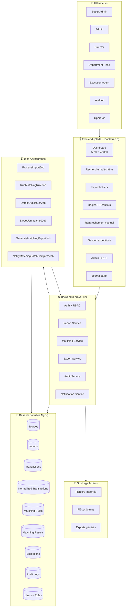

# Carte finale du système

## Vue synthétique

## Principaux modules

| Module | Pages | API Endpoints | Entités |
|--------|-------|---------------|---------|
| **Auth** | Login, Register, Reset | 10+ routes | `users`, `roles`, `permissions` |
| **Dashboard** | Dashboard | 1 | `transactions`, `exceptions`, `imports` |
| **Import** | Liste, Upload, Détail | 5 | `imports`, `import_rows`, `transactions` |
| **Matching** | Règles, Résultats | 10+ | `matching_rules`, `matching_results`, `matching_details` |
| **Reconciliation** | Rapprochement manuel | 2 | `matching_results`, `normalized_transactions` |
| **Exceptions** | Liste, Détail | 6 | `exceptions`, `exception_attachments` |
| **Search** | Recherche | 3 | `transactions`, `normalized_transactions` |
| **Admin** | Banques, Sources, Devises, etc. | 20+ | `banks`, `sources`, `currencies`, `holidays`, `settings` |
| **Users** | Utilisateurs, Rôles | 10+ | `users`, `roles`, `permissions` |
| **Audit** | Journal d'audit | 2 | `audit_logs` |

## Principales APIs (endpoints JSON)

| Endpoint | Méthode | Usage |
|----------|---------|-------|
| `/admin/imports/data` | GET | DataTables imports |
| `/admin/matching-rules/data` | GET | DataTables règles |
| `/admin/matching-results/data` | GET | DataTables résultats |
| `/admin/exceptions/data` | GET | DataTables exceptions |
| `/admin/search/data` | GET | DataTables recherche |
| `/admin/audit-logs/data` | GET | DataTables audit |
| `/admin/users/data` | GET | DataTables utilisateurs |
| `/admin/reconciliation/search` | GET | Recherche transactions non appariées |

## Principales entités

| Entité | Table | Rôle |
|--------|-------|------|
| **User** | `users` | Utilisateur avec rôles Spatie |
| **Source** | `sources` | Source de données (ALPHA, BNA, WEB, SMT) |
| **Import** | `imports` | Import de fichier |
| **Transaction** | `transactions` | Transaction brute importée |
| **NormalizedTransaction** | `normalized_transactions` | Transaction normalisée pour matching |
| **MatchingRule** | `matching_rules` | Règle de rapprochement |
| **MatchingResult** | `matching_results` | Résultat d'un appariement |
| **ExceptionRecord** | `exceptions` | Anomalie détectée |
| **AuditLog** | `audit_logs` | Entrée de journal d'audit |

## Services centraux

| Service | Fichier | Rôle |
|---------|---------|------|
| **RuleMatcher** | `app/Services/Matching/RuleMatcher.php` | Moteur de rapprochement |
| **MappingEngine** | `app/Services/Import/MappingEngine.php` | Transformation des données |
| **TransactionNormalizer** | `app/Services/Import/TransactionNormalizer.php` | Normalisation des transactions |
| **DuplicateDetector** | `app/Services/Matching/DuplicateDetector.php` | Détection des doublons |
| **UnmatchedSweeper** | `app/Services/Matching/UnmatchedSweeper.php` | Détection des orphelins |
| **DashboardMetricsService** | `app/Services/DashboardMetricsService.php` | KPIs du dashboard |
| **AuditLogService** | `app/Services/AuditLogService.php` | Journal d'audit |

## Workflows principaux

| Workflow | Déclenchement | Jobs | Résultat |
|----------|---------------|------|----------|
| **Import** | Upload fichier | `ProcessImportJob` | Transactions normalisées |
| **Matching** | Run règle | `RunMatchingRuleJob` | Résultats + exceptions |
| **Batch** | Run-all | Chaîne de jobs | Tous les matchings + doublons + orphelins |
| **Rapprochement manuel** | Action utilisateur | Aucun | Appariement manuel |
| **Export** | Action utilisateur | `GenerateMatchingExportJob` | Fichier CSV/XLSX/PDF |
| **Résolution exception** | Action utilisateur | Aucun | Exception résolue/ignorée |

## Rôles et accès

| Rôle | Niveau d'accès |
|------|----------------|
| **super-admin** | Total (bypass) |
| **admin** | Total |
| **director** | Lecture + audit |
| **department-head** | CRUD métier + utilisateurs |
| **execution-agent** | Rapprochement + exceptions |
| **auditor** | Lecture + audit |
| **operator** | Opérations quotidiennes |

## Systèmes externes

| Service | Statut | Usage potentiel |
|---------|--------|-----------------|
| **SMTP** | Configuré, non actif (log) | Envoi d'emails |
| **AWS S3** | Configuré, non actif | Stockage fichiers |
| **Redis** | Configuré, non actif | Cache/Queue |
| **DomPDF** | Actif | Génération PDF |
| **Maatwebsite/Excel** | Actif | Import/Export Excel |

---

## Références rapides

| Besoin | Fichier |
|--------|---------|
| Routes | `routes/web.php` |
| Modèles | `app/Models/` |
| Services | `app/Services/` |
| Jobs | `app/Jobs/` |
| Contrôleurs | `app/Http/Controllers/` |
| Vues | `resources/views/` |
| Config | `config/` |
| Migrations | `database/migrations/` |
| Seeders | `database/seeders/` |
| Tests | `tests/` |
| Policies | `app/Policies/` |
| Enums | `app/Enums/` |
| Transforms | `app/Services/Import/Transforms/` |
| Notifications | `app/Notifications/` |
| Listeners | `app/Listeners/` |
