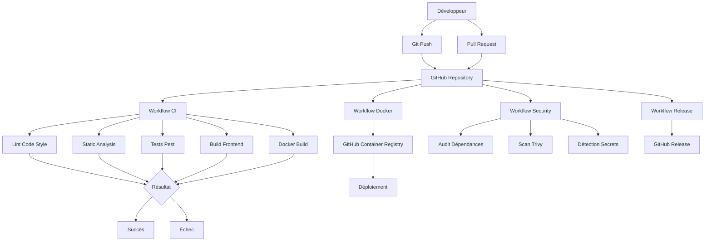
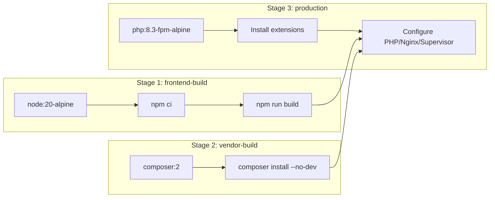

# Documentation CI/CD et Tests

## Table des matières

1. [Vue d'ensemble du CI/CD](#1-vue-densemble-du-cicd)
2. [Architecture du pipeline](#2-architecture-du-pipeline)
3. [GitHub Actions Workflows](#3-github-actions-workflows)
4. [Docker et Conteneurisation](#4-docker-et-conteneurisation)
5. [Types de Tests](#5-types-de-tests)
6. [Exécution des Tests](#6-exécution-des-tests)
7. [Couverture de Code](#7-couverture-de-code)
8. [Sécurité](#8-sécurité)
9. [Environnements](#9-environnements)
10. [Commandes Rapides](#10-commandes-rapides)

---

## 1. Vue d'ensemble du CI/CD

La chaîne CI/CD de l'application **Rapprochement STEG** permet d'automatiser :

- La vérification de la qualité du code (lint, static analysis)
- L'exécution des tests (unitaires, d'intégration, fonctionnels)
- La compilation des assets frontend
- La construction d'images Docker
- La publication des images sur GitHub Container Registry (GHCR)
- Les scans de sécurité
- La création de releases

### Diagramme global du pipeline



---

## 2. Architecture du pipeline

### 2.1 Structure des fichiers

```
.github/
├── workflows/
│   ├── ci.yml           # Pipeline CI principal
│   ├── docker.yml       # Build et push Docker
│   ├── security.yml     # Scans de sécurité
│   └── release.yml      # Releases automatiques
└── dependabot.yml       # Mise à jour automatique des dépendances
```

### 2.2 Déclencheurs des workflows

| Workflow | Push | Pull Request | Tags | Schedule |
|----------|------|--------------|------|----------|
| `ci.yml` | `master`, `develop` | `master`, `develop` | - | - |
| `docker.yml` | `master` | mergées | `v*` | - |
| `security.yml` | `master`, `develop` | `master` | - | Lundi 00:00 |
| `release.yml` | - | - | `v*.*.*` | - |

### 2.3 Concurrency

Les workflows sont configurés pour annuler les pipelines en cours sur la même branche :

```yaml
concurrency:
  group: ${{ github.workflow }}-${{ github.ref }}
  cancel-in-progress: true
```

---

## 3. GitHub Actions Workflows

### 3.1 Workflow CI Principal (`ci.yml`)

**Déclencheur :** Push/PR sur `master`, `develop`

**Jobs :**

| Job | Description | Temps estimé |
|-----|-------------|--------------|
| `lint` | Vérification du code style avec Laravel Pint | ~2 min |
| `static-analysis` | Analyse statique avec PHPStan (si installé) | ~2 min |
| `tests` | Tests Pest avec couverture (SQLite) | ~10 min |
| `frontend` | Build des assets frontend avec Vite | ~3 min |
| `docker-build` | Vérification du build Docker | ~10 min |

**Détail des jobs :**

#### Job: Lint

```yaml
lint:
  name: Lint & Code Style
  runs-on: ubuntu-latest
  steps:
    - uses: actions/checkout@v4
    - uses: shivammathur/setup-php@v2
      with:
        php-version: '8.3'
    - run: composer install
    - run: vendor/bin/pint --test --verbose
```

#### Job: Tests

```yaml
tests:
  name: Tests
  runs-on: ubuntu-latest
  strategy:
    matrix:
      php-version: ['8.2', '8.3']
  steps:
    - uses: actions/checkout@v4
    - uses: shivammathur/setup-php@v2
      with:
        php-version: ${{ matrix.php-version }}
        coverage: xdebug
    - run: composer install
    - run: cp .env.example .env
    - run: php artisan key:generate
    - run: php artisan migrate --force
    - run: php artisan test --coverage --min=80
```

#### Job: Frontend Build

```yaml
frontend:
  name: Frontend Build
  runs-on: ubuntu-latest
  steps:
    - uses: actions/checkout@v4
    - uses: actions/setup-node@v4
      with:
        node-version: '20'
        cache: 'npm'
    - run: npm ci
    - run: npm run build
```

#### Job: Docker Build

```yaml
docker-build:
  name: Docker Build Test
  runs-on: ubuntu-latest
  steps:
    - uses: actions/checkout@v4
    - uses: docker/setup-buildx-action@v3
    - uses: docker/build-push-action@v5
      with:
        context: .
        push: false
        load: true
        tags: reconciliation-app:test
    - run: docker run --rm reconciliation-app:test php artisan --version
```

---

### 3.2 Workflow Docker (`docker.yml`)

**Déclencheur :** Push sur `master`, tags `v*`, PRs mergées

**Actions :**
1. Setup Docker Buildx
2. Login vers GitHub Container Registry
3. Extraction des métadonnées (tags)
4. Build multi-architecture (amd64, arm64)
5. Push vers GHCR

**Stratégie de tags :**

| Tag | Condition |
|-----|-----------|
| `latest` | Push sur `master` |
| `v1.2.3` | Tag `v1.2.3` |
| `v1.2` | Tag `v1.2.3` |
| `v1` | Tag `v1.2.3` |
| `master` | Push sur `master` |
| `sha-abc123` | Chaque commit |

---

### 3.3 Workflow Sécurité (`security.yml`)

**Déclencheur :** Push/PR sur `master`, `develop`, schedule (lundi 00:00)

**Jobs :**

| Job | Description | Outil |
|-----|-------------|-------|
| `composer-audit` | Audit des dépendances Composer | `composer audit` |
| `npm-audit` | Audit des dépendances NPM | `npm audit` |
| `trivy-scan` | Scan de vulnérabilités Docker | Trivy |
| `secret-detection` | Détection de secrets | GitLeaks |

---

### 3.4 Workflow Release (`release.yml`)

**Déclencheur :** Tags `v*.*.*`

**Actions :**
1. Build des assets frontend
2. Création d'une archive ZIP
3. Création d'une release GitHub avec notes automatiques

---

### 3.5 Dependabot (`dependabot.yml`)

Configuration pour la mise à jour automatique des dépendances :

| Écosystème | Fréquence | Limite PR |
|------------|-----------|-----------|
| Composer | Hebdomadaire (lundi) | 10 |
| NPM | Hebdomadaire (lundi) | 10 |
| GitHub Actions | Hebdomadaire (lundi) | 5 |
| Docker | Hebdomadaire (lundi) | 5 |

---

## 4. Docker et Conteneurisation

### 4.1 Dockerfile

Le Dockerfile utilise un **build multi-stage** pour optimiser la taille de l'image :



**Stages :**

| Stage | Image de base | Usage |
|-------|---------------|-------|
| `frontend-build` | `node:20-alpine` | Compilation des assets Vite |
| `vendor-build` | `composer:2` | Installation dépendances Composer |
| `production` | `php:8.3-fpm-alpine` | Image finale optimisée |

**Caractéristiques de l'image production :**
- PHP 8.3 avec extensions (pdo_mysql, mbstring, gd, zip, intl, bcmath)
- Nginx comme serveur web
- Supervisor pour la gestion des processus
- Utilisateur non-root (`www`)
- OPcache configuré pour la production
- Health check intégré

### 4.2 Docker Compose

#### Services en production (`docker-compose.yml`)

| Service | Image | Port | Description |
|---------|-------|------|-------------|
| `app` | Build Dockerfile | 8080 | Application Laravel (PHP-FPM + Nginx) |
| `mysql` | mysql:8.0 | 3306 | Base de données |
| `queue-worker` | Build Dockerfile | - | Worker pour les jobs asynchrones |
| `scheduler` | Build Dockerfile | - | Planificateur de tâches |

#### Services en développement (`docker-compose.dev.yml`)

| Service | Image | Port | Description |
|---------|-------|------|-------------|
| `app` | Build Dockerfile | 8080 | Application (hot reload) |
| `mysql` | mysql:8.0 | 3306 | Base de données |
| `queue-worker` | Build Dockerfile | - | Worker pour les jobs |

### 4.3 Configuration Docker

#### PHP (`docker/php/php.ini-production`)

```ini
memory_limit = 512M
max_execution_time = 300
upload_max_filesize = 50M
post_max_size = 50M
opcache.enable = 1
opcache.memory_consumption = 256
opcache.validate_timestamps = 0
```

#### Nginx (`docker/nginx/default.conf`)

- Headers de sécurité (CSP, HSTS, X-Frame-Options)
- Compression Gzip
- Cache des assets statiques
- Blocage des fichiers sensibles

#### Supervisor (`docker/supervisor/supervisord.conf`)

Gestion de deux processus :
- `php-fpm` — Processus PHP-FPM
- `nginx` — Serveur web Nginx

---

## 5. Types de Tests

### 5.1 Vue d'ensemble

L'application utilise **Pest PHP** comme framework de tests, avec **PHPUnit** comme moteur sous-jacent.

**Statistiques :**

| Métrique | Valeur |
|----------|--------|
| Nombre total de tests | 238 |
| Assertions | 821 |
| Fichiers de test | 47 |
| Durée d'exécution | ~107 secondes |

### 5.2 Structure des tests

```
tests/
├── Pest.php                    # Configuration + helpers
├── TestCase.php                # Classe de base
├── Feature/                    # Tests d'intégration
│   ├── Admin/                  # Tests CRUD admin
│   │   ├── BankCrudTest.php
│   │   ├── UserCrudTest.php
│   │   ├── ImportUploadTest.php
│   │   ├── MatchingRuleRunTest.php
│   │   └── ...
│   ├── Auth/                   # Tests authentification
│   │   ├── AuthenticationTest.php
│   │   ├── PasswordResetTest.php
│   │   └── ...
│   ├── DashboardTest.php
│   ├── ProcessImportJobTest.php
│   ├── RealSourceFileFormatsTest.php
│   ├── NotificationTest.php
│   └── ...
└── Unit/                       # Tests unitaires
    ├── EnumsTest.php
    ├── MappingEngineTest.php
    ├── DashboardMetricsServiceTest.php
    ├── Matching/
    │   ├── RuleMatcherTest.php
    │   ├── DuplicateDetectorTest.php
    │   └── UnmatchedSweeperTest.php
    └── Transforms/
        ├── TrimTransformTest.php
        ├── DateParseTransformTest.php
        └── ...
```

### 5.3 Tests Unitaires

Les tests unitaires vérifient le comportement isolé des composants.

#### Tests des Transforms (`tests/Unit/Transforms/`)

| Test | Description | Transform testée |
|------|-------------|------------------|
| `TrimTransformTest` | Trim, whitespace → null, scalar cast | `trim` |
| `DateParseTransformTest` | Parsing formats d/m/Y, Y-m-d, Y.m.d, dmY | `date_parse` |
| `DecimalStringToMillimesTransformTest` | Conversion décimal → millimes | `decimal_string_to_millimes` |
| `FixedWidthMillimesTransformTest` | Parsing fixed-width, négatifs | `fixed_width_millimes` |
| `StripPrefixCharsTransformTest` | Suppression préfixes B/b | `strip_prefix_chars` |
| `SubstringAfterNthDelimiterTransformTest` | Sous-chaîne après Nième délimiteur | `substring_after_nth_delimiter` |
| `ZeroPadTransformTest` | Zero-padding à longueur fixe | `zero_pad` |
| `RightCharsTransformTest` | Extraction N derniers caractères | `right_chars` |

**Exemple :**

```php
// tests/Unit/Transforms/TrimTransformTest.php
it('trims surrounding whitespace', function () {
    $transform = new TrimTransform();
    expect($transform->apply('  hello  ', [], []))->toBe('hello');
});

it('turns an all-whitespace value into null', function () {
    $transform = new TrimTransform();
    expect($transform->apply('   ', [], []))->toBeNull();
});
```

#### Tests des Services (`tests/Unit/`)

| Test | Description |
|------|-------------|
| `DashboardMetricsServiceTest` | Agrégation KPIs, cache |
| `MappingEngineTest` | Transformation, validation headers |
| `ModelFillableGuardTest` | Guard non-vide sur tous les modèles |
| `HasUserstampsTest` | Auto-fill created_by/updated_by |
| `EnumsTest` | Labels, badge classes, core fields |

#### Tests du Moteur de Matching (`tests/Unit/Matching/`)

| Test | Description |
|------|-------------|
| `RuleMatcherTest` | Exact, partiel, conflit, tolérance, idempotence |
| `DuplicateDetectorTest` | Détection doublons, idempotence |
| `UnmatchedSweeperTest` | Balayage orphelins, idempotence |

**Exemple :**

```php
// tests/Unit/Matching/RuleMatcherTest.php
it('exact match on both amount and date creates a Matched result with full confidence', function () {
    // Arrange
    $rule = MatchingRule::factory()->create([...]);
    
    // Act
    $summary = $this->matcher->match($rule, 'test-batch');
    
    // Assert
    expect($summary->matched)->toBe(1);
    expect($summary->conflicts)->toBe(0);
});
```

### 5.4 Tests d'Intégration (Feature)

Les tests d'intégration vérifient les flux complets de l'application.

#### Tests CRUD Admin (`tests/Feature/Admin/`)

| Test | Description | Endpoints testés |
|------|-------------|------------------|
| `BankCrudTest` | CRUD banques, code unique, soft delete | `admin.banks.*` |
| `CurrencyCrudTest` | CRUD devises | `admin.currencies.*` |
| `SourceCrudTest` | CRUD sources | `admin.sources.*` |
| `SourceColumnMappingCrudTest` | Mapping colonnes, permissions | `admin.sources.mappings.*` |
| `HolidayCrudTest` | CRUD jours fériés, doublon date/pays | `admin.holidays.*` |
| `SettingCrudTest` | Paramètres groupés, update, cast | `admin.settings.*` |
| `UserCrudTest` | CRUD utilisateurs, auto-suppression | `admin.users.*` |
| `RoleCrudTest` | CRUD rôles, protection rôles système | `admin.roles.*` |
| `ImportCrudTest` | Liste, détail, filtres, permissions | `admin.imports.*` |
| `ImportUploadTest` | Upload, validation headers, doublon | `admin.imports.store` |
| `MatchingRuleCrudTest` | CRUD règles, sources identiques | `admin.matching-rules.*` |
| `MatchingRuleRunTest` | Run single, run-all, permissions | `admin.matching-rules.run` |
| `MatchingResultCrudTest` | Liste, détail, DataTables | `admin.matching-results.*` |
| `ExceptionCrudTest` | Liste, détail, résolution, attachments | `admin.exceptions.*` |
| `ReconciliationTest` | Recherche, appariement manuel, rejets | `admin.reconciliation.*` |
| `SearchTest` | Recherche multicritère, filtres | `admin.search.*` |
| `AuditLogTest` | Audit CRUD, login/logout | `admin.audit-logs.*` |
| `ExportTest` | Export CSV/XLSX/PDF, limites | `*.export` |
| `ExpensiveActionRateLimitTest` | Rate limit run rule, export | `throttle:expensive-actions` |

#### Tests Authentification (`tests/Feature/Auth/`)

| Test | Description |
|------|-------------|
| `AuthenticationTest` | Login, logout, mot de passe invalide |
| `EmailVerificationTest` | Vérification email, hash invalide |
| `PasswordConfirmationTest` | Confirmation mot de passe |
| `PasswordResetTest` | Demande reset, reset avec token |
| `PasswordUpdateTest` | Changement mot de passe |
| `RateLimitingTest` | Throttle register/forgot/reset |
| `RegistrationTest` | Inscription |

#### Tests Métier (`tests/Feature/`)

| Test | Description |
|------|-------------|
| `DashboardTest` | Rendu dashboard, KPIs, permissions |
| `ProcessImportJobTest` | Job import, erreurs par ligne, échec headers |
| `RealSourceFileFormatsTest` | Import fichiers réels WEB/SMT |
| `NotificationTest` | Notifications import, matching, doublons |
| `NotificationControllerTest` | Marquer lu, permissions |
| `ProfileTest` | Profil, update, suppression compte |
| `AuditLogTest` | Audit sur CRUD banques, login/logout |
| `QueryBudgetTest` | Budget requêtes (N+1 guard) |
| `RolePermissionTest` | Matrice rôles/permissions |
| `SecurityHeadersTest` | Headers sécurité |

### 5.5 Helpers de Tests

Le fichier `tests/Pest.php` fournit des helpers pour les tests :

```php
// tests/Pest.php

function actingAsAdmin(): User
{
    $user = User::factory()->create();
    $user->assignRole('admin');
    test()->actingAs($user);
    return $user;
}

function actingAsPlainUser(): User
{
    $user = User::factory()->create();
    test()->actingAs($user);
    return $user;
}

function actingAsDirector(): User { ... }
function actingAsDepartmentHead(): User { ... }
function actingAsExecutionAgent(): User { ... }
```

---

## 6. Exécution des Tests

### 6.1 En local

```bash
# Tous les tests
php artisan test

# Tests avec couverture
php artisan test --coverage --min=80

# Filtrer par nom
php artisan test --filter="RuleMatcherTest"

# Suite spécifique
php artisan test --testsuite=Unit
php artisan test --testsuite=Feature

# Tests parallèles
php artisan test --parallel
```

### 6.2 Avec Docker

```bash
# Exécuter les tests dans le conteneur
docker compose exec app php artisan test

# Avec couverture
docker compose exec app php artisan test --coverage --min=80
```

### 6.3 Avec le script d'aide

```bash
# Tests
./scripts/dev.sh test

# Tests avec couverture
./scripts/dev.sh test-coverage

# Tests filtrés
./scripts/dev.sh test --filter="RuleMatcherTest"
```

### 6.4 Avec Make

```bash
# Tests
make test

# Tests avec couverture
make test-coverage
```

### 6.5 Dans la CI

Les tests sont exécutés automatiquement dans GitHub Actions :

```yaml
# .github/workflows/ci.yml (extrait)
- name: Run tests with coverage
  env:
    DB_CONNECTION: sqlite
    DB_DATABASE: ':memory:'
  run: php artisan test --coverage --min=80 --coverage-clover=coverage.xml
```

---

## 7. Couverture de Code

### 7.1 Configuration

La couverture de code est configurée dans `phpunit.xml` :

```xml
<source>
    <include>
        <directory>app</directory>
    </include>
</source>
```

### 7.2 Seuil minimum

Le pipeline CI exige une couverture minimale de **80%** :

```bash
php artisan test --coverage --min=80
```

### 7.3 Génération du rapport

```bash
# Rapport HTML
php artisan test --coverage

# Rapport Clover (pour CI)
php artisan test --coverage --coverage-clover=coverage.xml
```

### 7.4 Artifacts

Le rapport de couverture est uploadé comme artifact GitHub Actions :

```yaml
- name: Upload coverage report
  uses: actions/upload-artifact@v4
  with:
    name: coverage-report
    path: coverage.xml
    retention-days: 7
```

---

## 8. Sécurité

### 8.1 Scans automatiques

Le workflow `security.yml` exécute :

| Scan | Outil | Cible |
|------|-------|-------|
| Audit Composer | `composer audit` | `composer.json` |
| Audit NPM | `npm audit` | `package.json` |
| Scan Docker | Trivy | Image Docker |
| Détection secrets | GitLeaks | Code source |

### 8.2 Headers de sécurité

Les headers suivants sont configurés dans Nginx :

```
X-Frame-Options: SAMEORIGIN
X-Content-Type-Options: nosniff
X-XSS-Protection: 1; mode=block
Referrer-Policy: strict-origin-when-cross-origin
Content-Security-Policy: default-src 'self'; ...
Strict-Transport-Security: max-age=31536000; includeSubDomains
```

### 8.3 Tests de sécurité

Le test `SecurityHeadersTest` vérifie la présence des headers :

```php
it('security headers are present on every response', function () {
    $response = $this->get('/dashboard');
    
    $response->assertHeader('X-Frame-Options', 'SAMEORIGIN');
    $response->assertHeader('X-Content-Type-Options', 'nosniff');
    // ...
});
```

---

## 9. Environnements

### 9.1 Development

```bash
# Docker Compose développement
docker compose -f docker-compose.dev.yml up -d

# Variables
APP_ENV=local
APP_DEBUG=true
```

### 9.2 Staging

```bash
# Docker Compose production
docker compose up -d

# Variables
APP_ENV=staging
APP_DEBUG=false
```

### 9.3 Production

```bash
# Docker Compose production (avec image GHCR)
docker compose up -d

# Variables
APP_ENV=production
APP_DEBUG=false
SESSION_SECURE_COOKIE=true
```

---

## 10. Commandes Rapides

### Commandes Docker

```bash
# Build
docker compose build

# Démarrer
docker compose up -d

# Arrêter
docker compose down

# Logs
docker compose logs -f

# Exécuter commande
docker compose exec app php artisan migrate
```

### Commandes Tests

```bash
# Tous les tests
php artisan test

# Avec couverture
php artisan test --coverage --min=80

# Filtré
php artisan test --filter="RuleMatcherTest"

# Unitaires uniquement
php artisan test --testsuite=Unit

# Feature uniquement
php artisan test --testsuite=Feature
```

### Commandes Make

```bash
make install       # Installation dépendances
make setup         # Setup complet
make test          # Tests
make test-coverage # Tests avec couverture
make lint          # Vérification style
make lint-fix      # Correction style
make build         # Build frontend
make docker-build  # Build Docker
make docker-up     # Démarrer Docker
make docker-down   # Arrêter Docker
make ci            # Tous les checks CI
```

### Commandes Script

```bash
./scripts/dev.sh install        # Installation
./scripts/dev.sh setup          # Setup complet
./scripts/dev.sh test           # Tests
./scripts/dev.sh test-coverage  # Tests avec couverture
./scripts/dev.sh lint           # Lint
./scripts/dev.sh lint-fix       # Fix lint
./scripts/dev.sh build          # Build frontend
./scripts/dev.sh docker-build   # Build Docker
./scripts.dev.sh docker-up      # Démarrer Docker
./scripts/dev.sh docker-down    # Arrêter Docker
./scripts/dev.sh clean          # Nettoyer
./scripts/dev.sh optimize       # Optimiser production
```

---

## Annexes

### A. Configuration PHPUnit

```xml
<!-- phpunit.xml -->
<phpunit bootstrap="vendor/autoload.php">
    <testsuites>
        <testsuite name="Unit">
            <directory>tests/Unit</directory>
        </testsuite>
        <testsuite name="Feature">
            <directory>tests/Feature</directory>
        </testsuite>
    </testsuites>
    <php>
        <env name="DB_CONNECTION" value="sqlite"/>
        <env name="DB_DATABASE" value=":memory:"/>
        <env name="QUEUE_CONNECTION" value="sync"/>
    </php>
</phpunit>
```

### B. Configuration Pest

```php
// tests/Pest.php
uses(Tests\TestCase::class, Illuminate\Foundation\Testing\RefreshDatabase::class)
    ->in('Feature');

function actingAsAdmin(): User
{
    $user = User::factory()->create();
    $user->assignRole('admin');
    test()->actingAs($user);
    return $user;
}
```

### C. Variables d'environnement pour les tests

| Variable | Valeur | Description |
|----------|--------|-------------|
| `APP_ENV` | `testing` | Environnement de test |
| `DB_CONNECTION` | `sqlite` | Base de données SQLite |
| `DB_DATABASE` | `:memory:` | Base en mémoire |
| `QUEUE_CONNECTION` | `sync` | Exécution synchrone |
| `SESSION_DRIVER` | `array` | Sessions en mémoire |
| `MAIL_MAILER` | `array` | Emails en mémoire |
| `CACHE_STORE` | `array` | Cache en mémoire |
| `BCRYPT_ROUNDS` | `4` | Hash rapide pour les tests |
