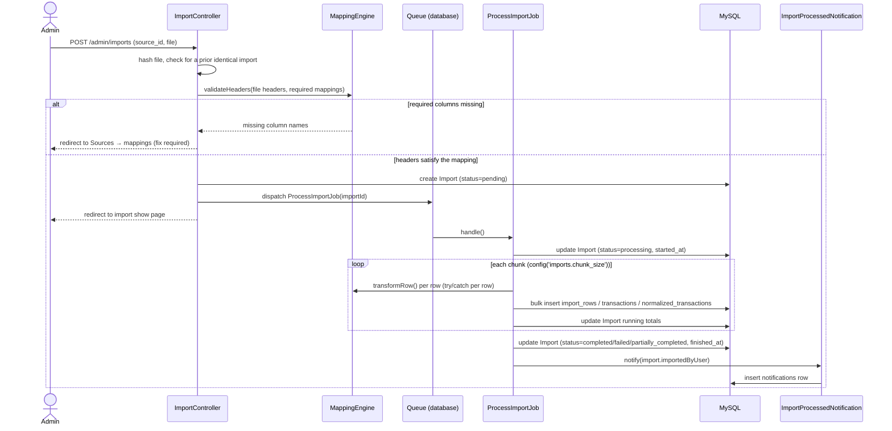
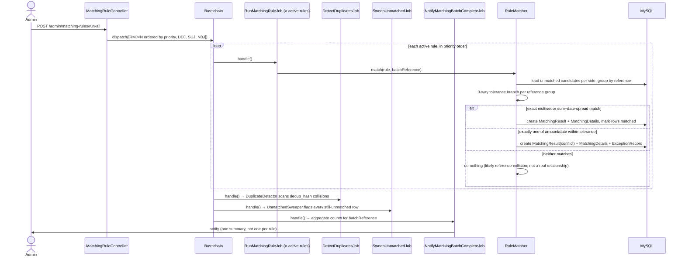
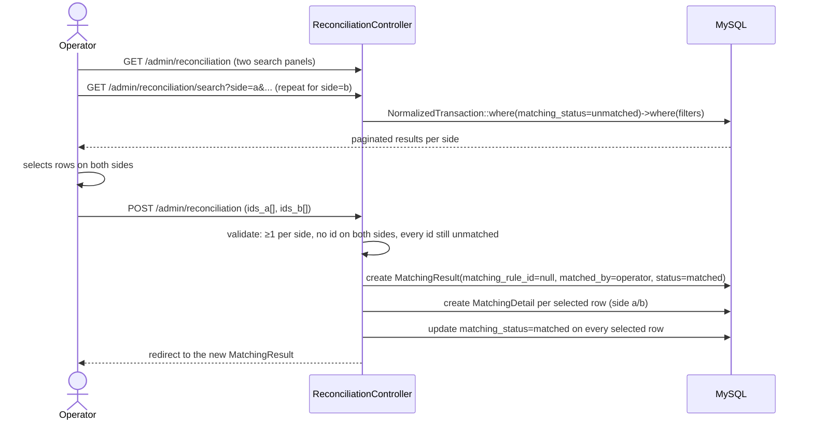

# Core Workflow Sequences

Three flows that best illustrate how the pieces fit together. All three are
covered by automated tests (`ProcessImportJobTest`, `RuleMatcherTest`,
`ReconciliationTest`, `NotificationTest`) and were manually verified against
real bank/payment export files.

## 1. Import flow

Upload a file, validate its columns against the source's saved mapping,
process it in a chunked queued job, notify the uploader when it's done.

## 2. Matching flow ("Lancer tout")

Runs every active rule in priority order (rules cumulatively consume the
shared unmatched pool, so order matters), then duplicate detection, then
the unmatched sweep, then one aggregate notification.

## 3. Manual reconciliation flow

For whatever the automated rules can't resolve — an operator searches both
sides independently and links a specific set of rows by hand.

