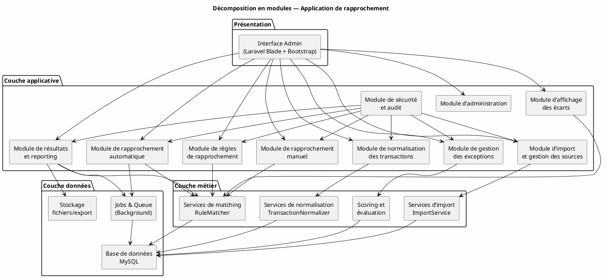

# Architecture et décomposition en modules

## 1. Vue d’ensemble

L’application de rapprochement est structurée en couches :

- **Présentation** : interface admin Laravel/Blade/Bootstrap
- **Applicative** : 10 modules métier
- **Métier** : services de matching, d’import, de normalisation, de scoring
- **Données** : MySQL, jobs/queue, stockage fichiers

## 2. Décomposition en modules

### Module 1 — Import et gestion des sources
- Gestion des sources (ALPHA, BNA, WEB, SMT)
- Import CSV/XLSX avec mapping de colonnes
- Transformation et normalisation
- Suivi des imports et audit

### Module 2 — Normalisation des transactions
- Nettoyage et standardisation
- Détection/suppression des doublons
- Gestion des valeurs nulles
- Calcul des champs dérivés

### Module 3 — Règles de rapprochement
- Configuration par paire de sources
- Clé primaire simple / composite
- Champs de vérification secondaires
- Tolérances et statuts exclus
- Priorisation et activation/désactivation

### Module 4 — Rapprochement automatique
- Exécution séquentielle des règles
- Traitement par lots (`batch_reference`)
- Groupement par clé primaire
- Calcul du score de confiance
- Résultats : matched / partial / conflict / no_signal
- Traitement asynchrone via jobs

### Module 5 — Rapprochement manuel
- Recherche et filtrage des transactions non rapprochées
- Sélection bidirectionnelle A / B
- Création de rapprochements manuels
- Traçabilité opérateur

### Module 6 — Gestion des exceptions
- Détection automatique des anomalies
- Types : doublons, dépassement de tolérance, orphelins
- Workflow de revue (assignation, résolution, commentaires)
- Pièces jointes et suivi d’état

### Module 7 — Affichage des écarts
- Sélection de deux imports
- Tableau A sans correspondance dans B
- Tableau B sans correspondance dans A
- Filtres avancés

### Module 8 — Résultats et reporting
- Liste et détail des résultats
- Export CSV / Excel / PDF
- Génération asynchrone des exports volumineux

### Module 9 — Sécurité et audit
- Authentification et autorisations par rôles
- Journal d’audit
- Notifications
- Permissions fines par ressource

### Module 10 — Administration
- Gestion des banques, devises, sources
- Paramétrage des mappings
- Gestion des jours fériés
- Utilisateurs et rôles

## 3. Diagramme PlantUML

## 4. Règles de rapprochement par combinaison

| Combinaison | Clé primaire A | Clé primaire B | Vérification |
|-------------|----------------|----------------|--------------|
| ALPHA ↔ BNA | `num_autorisation` | `num_autorisation` | montant + date |
| ALPHA ↔ WEB | `reference` + `num_autorisation` | `reference` + `recu_paie` | montant + date |
| ALPHA ↔ SMT | `date|amount` | `date|amount` | — |
| SMT ↔ BNA | `date|amount` | `date|amount` | — |
| WEB ↔ BNA | `secondary_reference` | `num_autorisation` | montant + date |
| WEB ↔ SMT | `date|amount` | `date|amount` | — |
