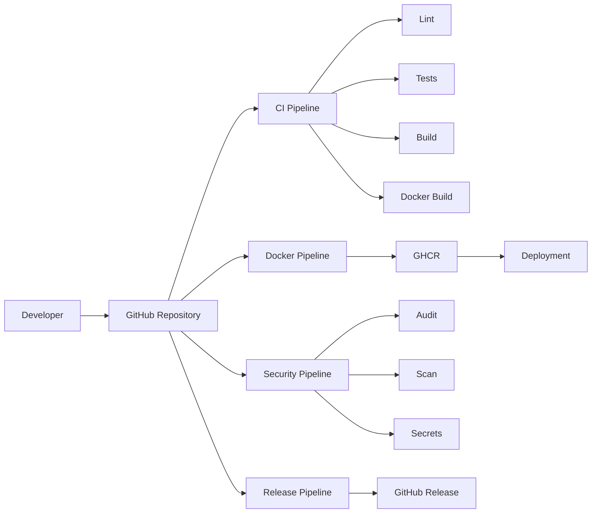

# CI/CD Pipeline Documentation

## Vue d'ensemble

Le pipeline CI/CD est configuré avec GitHub Actions et comprend 4 workflows principaux :



## Workflows

### 1. CI Pipeline (`ci.yml`)

**Déclencheur :** Push/PR sur `main`, `develop`

**Jobs :**

| Job | Description | Temps |
|-----|-------------|-------|
| `lint` | Vérification du code style avec Laravel Pint | ~2 min |
| `static-analysis` | Analyse statique (PHPStan si installé) | ~2 min |
| `tests` | Exécution des tests Pest avec couverture | ~10 min |
| `frontend` | Build des assets frontend | ~3 min |
| `docker-build` | Vérification que l'image Docker se build | ~10 min |

**Conditions de succès :**
- Tous les tests passent
- Couverture de tests ≥ 80%
- Le code respecte le style Pint
- L'image Docker se construit sans erreur

### 2. Docker Pipeline (`docker.yml`)

**Déclencheur :** Push sur `main`, tags `v*`, PRs mergées

**Actions :**
- Build de l'image Docker (multi-arch: amd64, arm64)
- Push vers GitHub Container Registry (ghcr.io)
- Tags automatiques

**Stratégie de tags :**

| Tag | Condition |
|-----|-----------|
| `latest` | Push sur `main` |
| `v1.2.3` | Tag `v1.2.3` |
| `v1.2` | Tag `v1.2.3` |
| `v1` | Tag `v1.2.3` |
| `main` | Push sur `main` |
| `sha-abc123` | Chaque commit |

### 3. Security Pipeline (`security.yml`)

**Déclencheur :** Push/PR sur `main`, `develop`, schedule (lundi 00:00)

**Jobs :**

| Job | Description |
|-----|-------------|
| `composer-audit` | Audit des dépendances Composer |
| `npm-audit` | Audit des dépendances NPM |
| `trivy-scan` | Scan de vulnérabilités de l'image Docker |
| `secret-detection` | Détection de secrets avec GitLeaks |

### 4. Release Pipeline (`release.yml`)

**Déclencheur :** Tags `v*.*.*`

**Actions :**
- Build des assets frontend
- Création d'une archive ZIP
- Création d'une release GitHub avec notes automatiques

## Configuration requise

### Secrets GitHub

| Secret | Description | Requis |
|--------|-------------|--------|
| `GITHUB_TOKEN` | Token automatique GitHub | ✅ Fourni automatiquement |

### Variables GitHub

| Variable | Description | Valeur par défaut |
|----------|-------------|-------------------|
| `APP_ENV` | Environnement | `production` |
| `APP_DEBUG` | Mode debug | `false` |

### Branch Protection

Pour la branche `main`, configurer :

1. **Settings → Branches → Add rule**
2. **Branch name pattern:** `main`
3. **Protection rules:**
   - ✅ Require a pull request before merging
   - ✅ Require status checks to pass
   - ✅ Require branches to be up to date
   - ✅ Include administrators

**Status checks requis :**
- `lint`
- `tests (8.2)`
- `tests (8.3)`
- `frontend`
- `docker-build`

## Exécution locale

### Avec le script d'aide

```bash
# Exécuter tous les checks CI localement
./scripts/dev.sh lint
./scripts/dev.sh test
./scripts/dev.sh build
./scripts/dev.sh docker-build
```

### Sans le script

```bash
# Lint
vendor/bin/pint --test

# Tests
php artisan test

# Build frontend
npm run build

# Docker build
docker compose build
```

## Artifacts

Les artifacts sont conservés pendant 7 jours :

| Artifact | Workflow | Chemin |
|----------|----------|--------|
| Coverage report | ci | `coverage.xml` |
| Frontend build | ci | `public/build` |
| Release archive | release | `reconciliation-app-v*.zip` |

## Résolution des problèmes

### Les tests échouent dans la CI mais passent localement

1. Vérifiez les variables d'environnement
2. Vérifiez la version de PHP
3. Vérifiez les extensions PHP installées

```bash
# Exécuter les tests comme dans la ci
php artisan test --coverage --min=80
```

### Le build Docker échoue

1. Vérifiez le Dockerfile
2. Vérifiez les fichiers .dockerignore
3. Vérifiez les permissions

```bash
# Construire avec les logs détaillés
docker compose build --no-cache --progress=plain
```

### Le push vers GHCR échoue

1. Vérifiez que le package est activé dans les paramètres du repository
2. Vérifiez les permissions du token GITHUB_TOKEN
3. Vérifiez que le repository a accès à ghcr.io

```bash
# Se connecter manuellement à GHCR
echo $GITHUB_TOKEN | docker login ghcr.io -u USERNAME --password-stdin
```
